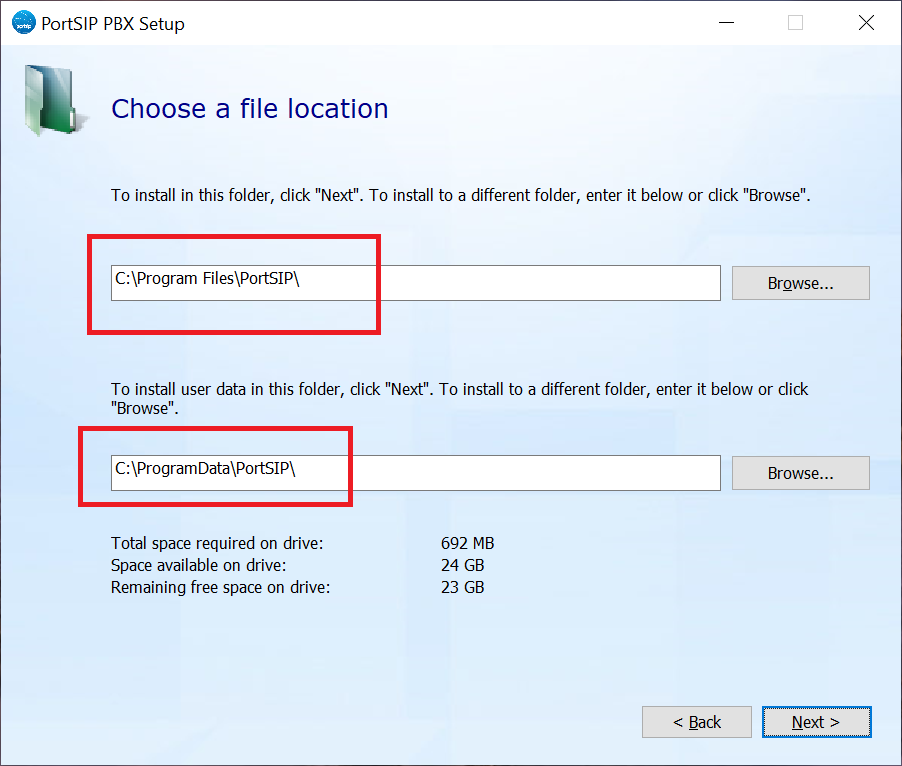

# 1 安装 PortSIP PBX
## 1.1 下载 PortSIP PBX
最新的[PortSIP PBX](https://www.portsip.com/portsip-pbx/)免费版本可以在[PortSIP网站](https://www.portsip.com/download-portsip-pbx/)上找到并下载。同时适用于64位Windows和Linux，但不适用32位版本。

PortSIP PBX的免费版最多可以提供3个并发通话和10个分机注册。如果需要更多的并发通话/分机，请参考[PortSIP PBX定价](https://www.portsip.com/portsip-pbx-pricing/)页面以获得更多细节。 

下载完成后，会得到安装程序。

## 1.2 在 Linux 上安装 PortSIP PBX
### 支持的Linux操作系统
- CentOS 7.9
- Ubuntu 18.04, 20.04, 22.04
- Debian 10.x, 11.x  

它只支持64位的操作系统。

### 准备安装的Linux主机
在安装PortSIP PBX之前，必须完成的任务是
- **确保服务器的日期时间同步正确。**
- 如果安装 PBX 的 Linux 位于局域网内，请为 PBX 服务器分配一个**静态的内网 IP**；如果是在公网上，请为 PBX 服务器分配一个**静态的公网 IP**和一个**静态的内网 IP**。
- 在安装PortSIP PBX之前，请安装所有可用的更新和服务包。
- 请不要在 PortSIP PBX 服务器上安装 ```PostgreSQL```。
- 确保系统和网络适配器的所有省电选项被禁用（通过设置系统为高性能模式）。
- 不要在主机上安装TeamViewer，VPN，和其他类似的软件。
- PortSIP PBX不能安装在作为DNS或DHCP服务器的主机上。
- 以下的端口必须在防火墙开放。
    - UDP: 5060, 5066, 25000-35000, 45000-65000
    - TCP: 5061, 5063, 5065, 5067, 8882, 8883, 8885, 8887, 8888.请同时确保上述端口没有被其他应用程序使用。
- 必须以root用户身份执行所有Linux命令，请先```su root```。

> 如果PBX运行在云平台上，如AWS，并且云平台有自己的防火墙，也必须在云平台的防火墙上打开端口。  

### 步骤1 下载安装脚本 
执行下面的命令，下载安装脚本
```
mkdir -p /opt/portsip
cd /opt/portsip && rm -rf *.sh
curl https://raw.githubusercontent.com/portsip/portsip-pbx-sh/master/v16.x/install_pbx_docker_cn.sh -o install_pbx_docker_cn.sh
curl https://raw.githubusercontent.com/portsip/portsip-pbx-sh/master/v16.x/pbx_ctl.sh -o pbx_ctl.sh
```
### 步骤2 设置Docker环境
执行下面的命令来安装```Docker-Compose```环境。如果提示类似```***cloud.cfg (Y/I/N/O/D/Z) [default=N] ?```，输入**Y**，然后按**回车键**。
```
cd /opt/portsip && /bin/sh install_pbx_docker.sh
```
### 步骤3 创建并运行PortSIP PBX Docker容器实例
下面的命令用于IP为```66.175.221.120```的服务器上创建和运行PBX。如果在没有公网IP的服务器运行PBX，只需将IP ```66.175.221.120```替换为PBX服务器的内网IP即可
```
cd /opt/portsip && /bin/sh pbx_ctl.sh run -p /var/lib/portsip -a 66.175.221.120 -i portsip/pbx:16
```
现在可以使用```https://66.175.221.120:8887``` 来访问 PBX；默认的系统管理员名称和密码是admin。  
在成功创建了PBX的docker实例后，可以使用下面的命令来管理它。

**显示 PBX Docker实例的状态**
```
cd /opt/portsip && /bin/sh pbx_ctl.sh status
```
**启动 PBX Docker实例**
```
cd /opt/portsip && /bin/sh pbx_ctl.sh start
```
**停止 PBX Docker 实例**
```
cd /opt/portsip && /bin/sh pbx_ctl.sh stop
```
**重新启动 PBX Docker 实例**
```
cd /opt/portsip && /bin/sh pbx_ctl.sh restart
```
**删除 PBX Docker 实例**
```
cd /opt/portsip && /bin/sh pbx_ctl.sh rm
```

## 1.3 在Windows上安装PortSIP PBX
### 支持的Windows操作系统
- Windows 10, 11
- Windows Server 2016, 2019, 2022

它只支持64位的操作系统。
### 准备安装的Windows主机
安装PortSIP PBX前必须完成的任务
- **确保服务器的日期时间同步正确。**
- 如果安装 PBX 的 Windows 电脑/服务器位于局域网内，为服务器分配一个**静态的内网IP**；如果位于公网，为服务器分配一个**静态的公网IP**和一个**静态的内网IP**。
- 在安装PortSIP PBX之前，请安装所有可用的Windows更新和服务包。在安装完Windows的更新后，重新启动可能会发现有额外的更新。在运行PortSIP PBX安装程序之前，要特别注意安装所有微软.Net的更新。
- 反病毒软件不应扫描以下目录，以避免复杂化和写访问延迟：```C:\Program Files\PortSIP; C:\Programdata\PortSIP```。
- 不要在 PortSIP PBX 服务器上安装 VPN 和 TeamViewer 软件。
- 不要在 PortSIP PBX 服务器上安装 ```PostgreSQL```。
- 确保 ```Windows 防火墙```服务已被启动。
- 确保系统和网络适配器的所有省电选项被禁用（通过设置系统为高性能模式）。
- 如果是Windows客户端的电脑，请禁用蓝牙适配器。
- PortSIP PBX不能安装在有DNS或DHCP服务器的主机上，也不能安装MS SharePoint或Exchange服务。
- 以下的端口必须在防火墙开放。
    - UDP: 5060, 5066, 25000-35000, 45000-65000
    - TCP：5061, 5063, 5065, 5067, 8882, 8883, 8885, 8887, 8888. 也请确保上述端口没有被其他应用程序使用。
- 确保Windows防火墙已启用。

> 如果PBX运行在云平台上，比如AWS，并且云平台有自己的防火墙，也**必须**在云平台的防火墙上打开端口。

### 安装新的 PortSIP PBX for Windows
PBX的安装程序可以在[PortSIP网站](https://www.portsip.com/download-portsip-pbx/)下载。  

要安装PortSIP PBX，只需要双击安装程序，将指导完成安装过程。  

安装成功后，PortSIP PBX服务将自动启动（此后每次启动电脑时都会自动启动）。

> 在安装过程中，选择 PBX 文件夹时，以下两个文件夹不能相同！




## 1.4 配置防火墙规则
在成功安装 PortSIP PBX 之后，PortSIP PBX 的端口已经在 Windows 和 Linux 下自动打开。  

为了使 PortSIP PBX 正常工作，以下端口必须在防火墙上开放。
- UDP: 5060, 5066, 25000-35000, 45000-65000
- TCP: 5061, 5063, 5065, 5067, 8882, 8883, 8885, 8887, 8888 请同时确保以上端口没有被其他应用程序使用。

传输协议添加新的端口。
- 假设TLS添加了5070端口，必须在防火墙中打开TCP 5070端口。
- 假设TCP添加了5071端口，必须在防火墙中打开TCP 5071端口。
- 假设UDP添加了5078端口，必须在防火墙中打开UDP 5078端口。

下面的例子是创建防火墙规则，允许TCP的5070端口。
```
sudo firewall-cmd --permanent --service=portsip-pbx --add-port=5070/tcp --set-description="PortSIP PBX"
sudo firewall-cmd --permanent --add-service=portsip-pbx
sudo firewall-cmd --reload
```
下面的例子是创建防火墙规则，允许UDP的5078端口。
```
sudo firewall-cmd --permanent --服务=portsip-pbx --add-port=5078/udp --set-description="PortSIP PBX"
sudo firewall-cmd --permanent --add-service=portsip-pbx
sudo firewall-cmd --reload
```
> 如果PBX运行在云平台上，比如AWS，并且云平台有自己的防火墙，也必须在云平台的防火墙上打开端口。

## 1.5 卸载 PortSIP PBX
请使用下面的步骤来卸载 PortSIP PBX for Linux。

**卸载SBC**
```
cd /opt/porsip
/bin/sh sbc_ctl.sh stop
/bin/sh sbc_ctl.sh rm
cd /var/lib/portsip/
rm -rf sbc
```
**卸载PBX**
```
cd /opt/portsip
/bin/sh pbx_ctl.sh stop
/bin/sh pbx_ctl.sh rm
cd /var/lib/portsip
rm -rf pbx 
rm -rf postgresql
```


