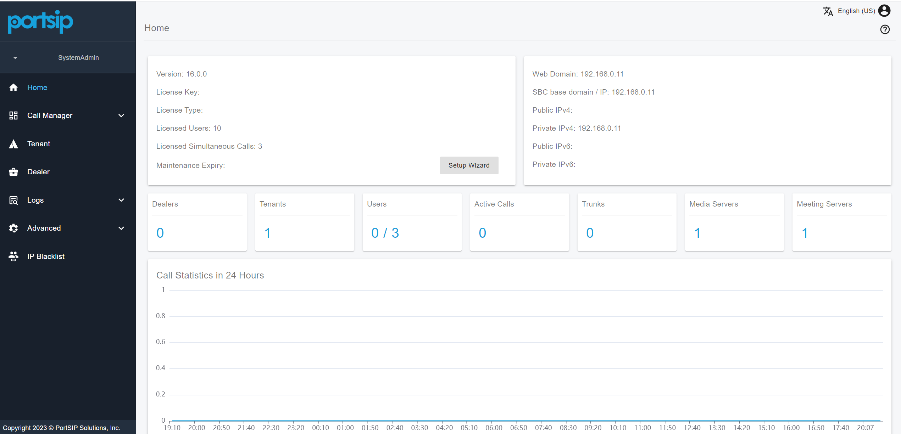
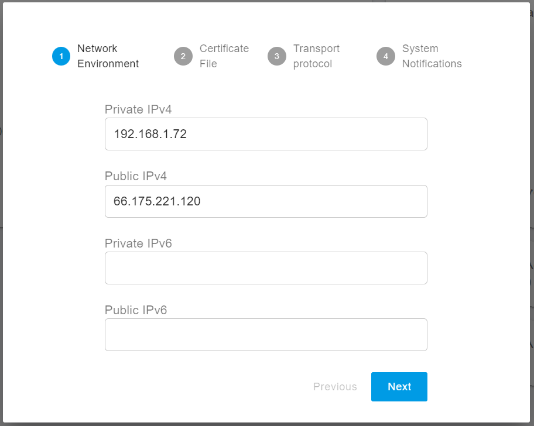
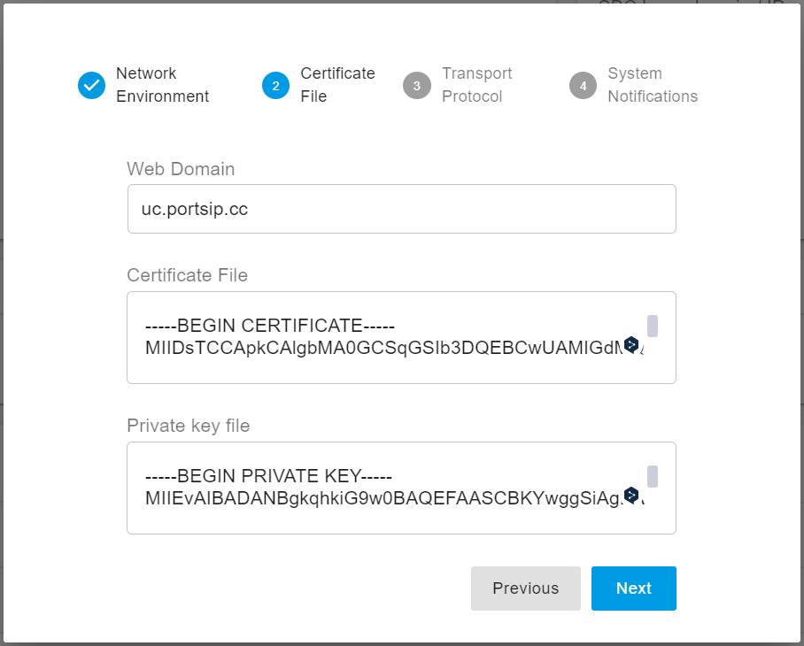
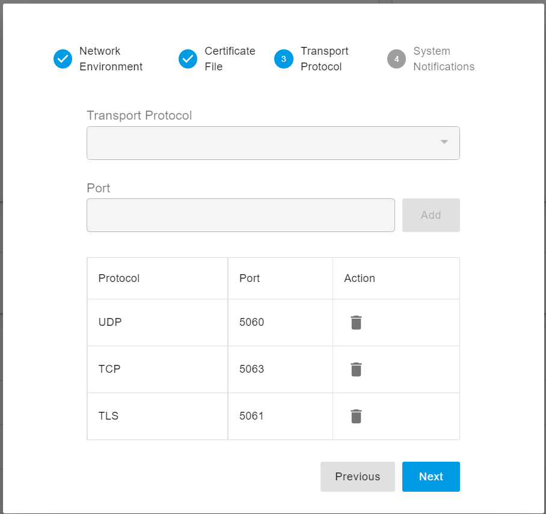

# 2 配置 PortSIP PBX
PortSIP PBX 安装成功后，请使用浏览器访问 https://66.175.221.120:8887 。如果浏览器显示SSL证书警告，请忽略它并继续操作；在用户名和密码中都输入 "**admin**"来登录。域名留空。PBX 仪表板页面应该如下图所示。



如果你还没有完成设置向导，它将在你登录到网页后自动出现。为了使 PBX 正常工作，必须对一些设置进行配置。

## 2.1 设置向导 1：网络环境
如果 PBX 服务器有一个**静态**的公共 IP，请在 "**Public IPv4**"中输入该IP。如果 PBX 服务器没有静态的公共 IP，请不要输入 "**Public IPv4**"。

必须输入Private IPv4，如果你的服务器没有私有 IP，请输入公共 IP。

公共IP和私有IP必须是你的SIP客户端可以访问的。这里输入的IP地址是PBX的SIP服务器IP地址。当SIP客户端或IP电话注册到PortSIP时，需要将PBX配置为 "**出站代理服务器**"。

如果PBX位于云端，这里应该输入 "**Private IPv4**"和 "**Public IPv4**"。如果位于局域网内，只需输入 "**Private IPv4**"。

> 环路（127.0.0.1）是不能作为内网 IP 的。只允许使用 PBX 所在局域网的静态 IP（不要使用 DHCP 动态 IP）。



## 2.2 设置向导 2：证书文件
为了支持 SIP 的 TLS 传输，并为 PBX Web 和 REST API 提供 HTTPS 访问，我们必须有一个可信任的 SSL 证书，并在这一步将其上传到 PBX。

你需要有一个网络域名，例如，从域名提供商（如 Godaddy）那里购买一个域名，并将该域名解析到你的 PBX IP。

你还需要为这个域名购买一个可信任的SSL证书，以避免浏览器的警告。建议使用证书提供商Digicert，GeoTrust，Godaddy，或其他证书提供商。

如果你没有这个域名或证书，你可以简单地输入PBX的IP作为网络域名，并接受这里的默认证书。默认情况下，PortSIP PBX 使用的是自签名证书，这将导致浏览器阻止连接并弹出警告信息。

请按照本指南的要求购买SSL证书：[准备TLS/HTTPS/WebRTC的TLS证书](https://support.portsip.com/tutorials/preparing-tls-certificates-for-tls-https-webrtc)。

你有两个证书文件。
- portsip.key
- portsip.pem

在 Web Domain 中输入 ```uc.portsip.cc```；在 Windows Notepad 中打开 ```portsip.pem``` 文件，将所有内容复制到 "**Certificate File**"中；将 ```portsip.key``` 文件的内容复制到 "**Private Key File** "字段中。



## 2.3 设置向导 3：传输协议
你可以通过点击添加按钮设置SIP信令的传输协议。默认情况下，传输协议端口是：
- UDP: 5060
- TCP: 5063
- TLS: 5061

你可以随意改变默认端口到新端口，但该端口不应该被其他应用程序使用。

> 一旦添加了新的端口，你必须改变防火墙规则以允许传输端口。IP话机将通过新的传输协议和端口连接到PBX。



## 2.4 系统通知
要启用 PortSIP PBX 的电子邮件通知功能来发送一些系统提示信息，必须配置 SMTP 的详细信息。

如果你使用谷歌的SMTP服务器，请确保你的Gmail账户启用了 "less secure"。

[Less secure apps & your Google Account.](https://support.google.com/accounts/answer/6010255?hl=en)

如果你使用谷歌SMTP服务器，你还需要选择SSL或TLS安全协议。

一旦 PBX 发生某些关键事件，警报邮件将被发送到 "收件人 "处。

## 2.5 重新启动以使证书生效
如果你在**步骤 2.2** 中上传了可信任的证书而不是自签的证书，请使用下面的命令重启 PBX，使证书生效。
```
cd /opt/portsip && /bin/sh pbx_ctl.sh restart
```
对于 Windows，只需简单地重启服务器。
