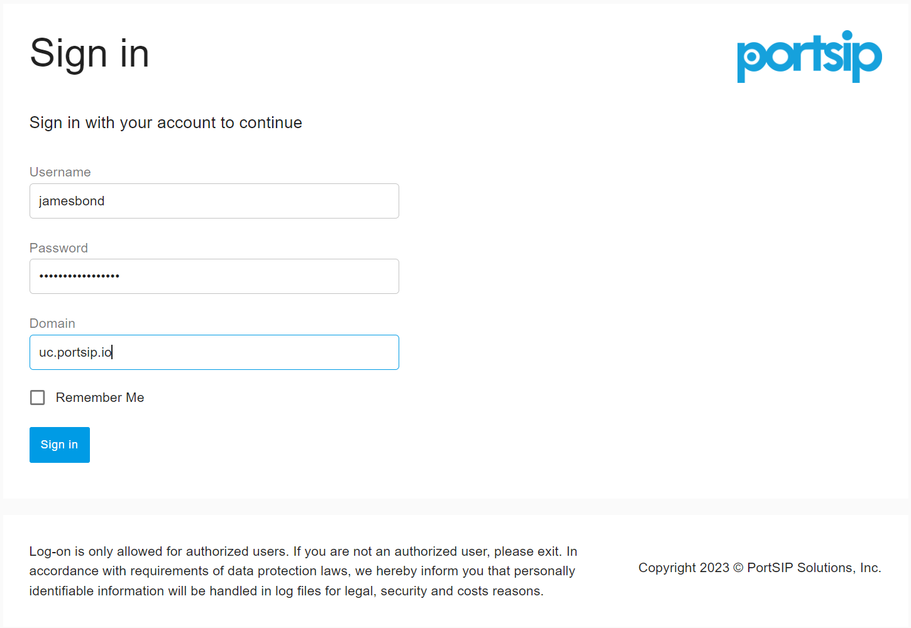
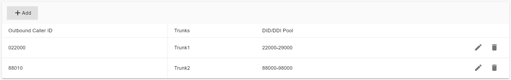
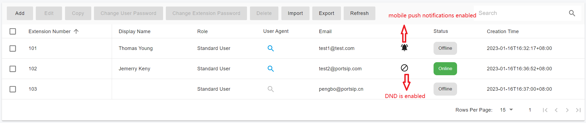
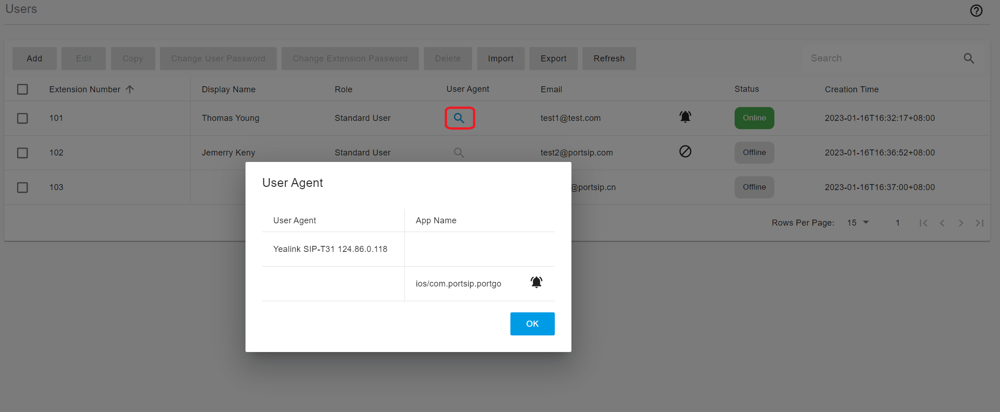

# 5 分机管理

本节介绍如何在 PortSIP PBX 中创建和配置分机，有多种方法来创建分机

+ 当配置一个新的电话时，你可以选择为该电话创建一个新的分机
+ 分机可以在左边的菜单中手动创建: "**通话管理 > 用户**"
+ 分机可以从```.csv```文件中导入
+ 通过调用REST API创建分机
+ 通过从现有的分机复制创建分机

要配置一个分机

1. 以 "**System Admin**" 的身份登录 PortSIP PBX Web Portal，点击菜单"**租户**"，选择一个租户，然后点击"**管理**"按钮来管理这个租户，配置呼入规则。或者将一个有```Admin 权限的用户```登录到 Web Portal，管理这个租户。

2. 在 PortSIP PBX Web Portal 点击左边的菜单选项 "**通话管理 > 用户**"。点击"**添加**"创建一个新的，或者选择一个现有的分机，点击"**编辑**"按钮，配置或管理现有的分机用户。

## 5.1 用户

在"**用户**"一栏中输入"**用户名**"和"**密码**"。请记住，该用户名和密码仅用于访问 PBX Web Portal。

用户可以通过从"**角色**"列表框中选择一个角色来授予权限。"**User**"角色表示用户有标准的分机访问权；"**Admin**"角色表示用户是租户管理员，可以通过 Web Portal 管理租户

如果一个用户拥有"**Admin**"角色，我们把他称为 "**Tenant Admin**"。"**Tenant Admin**" 可以管理租户。

PortSIP PBX支持为一个租户添加多个管理员。

"**邮箱**"字段是必填的，因为PBX需要将通知邮件发送到用户的电子邮件地址。

"**显示名称**"是用户的全名，如"**James Bond**"。

创建一个用户后，该用户可以使用"**用户名**"，"**密码**"，和租户的"**SIP 域名**"登录到 Web Portal。

请参考下面的截图，其中显示租户的用户登录到 Web Portal。



## 5.2 分机

分机号码和密码是必填字段，必须在"**分机**"页面下填写。

如果租户的SMTP服务器被配置，一旦成功创建分机，将向用户的电子邮件地址发送一封欢迎邮件，其中包括新创建的分机和PBX参数的详细信息，如PBX SIP域名、PBX IP和QR码。可以使用PortSIP UC App扫描QR码，注册到PBX，而无需手动输入任何信息。

这个分机有一个二维码，你可以保存二维码，使用PortSIP App扫描二维码登录到PBX，而不用手动输入信息。

在 "**在二维码中优先使用如下 Transport**"列表框中，您可以指定二维码的首选传输协议；当通过扫描二维码注册PBX时，PortSIP App将优先考虑首选传输协议。

在 "**生成二维码时使用下列网络接口**"选项中，您可以指定客户端应用程序在扫描QR码注册到PBX时的"**出站代理服务器**"地址。

你可以在"**外呼主叫ID**"部分，为分机从trunk和trunk DID号码范围中选择一个DID；当分机向外呼叫trunk时，"**外呼主叫ID**"将出现在INVITE SIP消息的"**FROM**"消息头。

如下面的截图所示，如果通过trunk 1拨打电话，"**外呼主叫ID**"将是"**022000**"，如果通过trunk 2拨打电话，"**外呼主叫ID**"将是"**88010**"。



对音频通话录音：如果选择了这个选项，任何带有这个分机音频通话都将被记录为音频文件。

对视频通话录制：如果选择了这个选项，任何带有这个分机视频通话都将被记录为视频文件，任何视频通话将被记录为视频文件（MP4）。

外呼时始终使用匿名呼叫：启用该选项后，发送到trunk的"**INVITE**"消息中的"**FROM**"，"**P-Asserted-Identity**"和"**P-Preferred-Identity**"消息头的user part将被设置为"anonymous"。

外呼时使用 Outbound Caller ID：如果启用该选项，"**外呼主叫ID**"将始终被设置为发送到trunk的INVITE中"FROM"消息头的user part。

## 5.3 转发规则

每个分机都有一套呼叫转移规则，定义当分机用户无法接听来电时，PortSIP PBX 应该怎么做。这可以通过以下标准进行配置。

+ 用户的状态

+ 时间

每个状态都需要一个呼叫转接规则。例如，如果用户在其状态为"**Available**"时无法接听电话，则可将电话转移到语音信箱或手机号码/固定电话。

```将呼叫转发到某个手机号码需要配置trunk和外拨规则```

转发规则有以下可选的值：

+ 转移到语音邮箱：呼叫将被转发到语音信箱服务，以便呼叫者可以留下语音信息。有一个选项可以为语音信箱选择一个分机号码。例如，如果你选择分机108，语音邮件将被保存在108的邮箱里；如果你留空，语音邮件将被保存在分机自己的邮箱里。

+ 转移到号码：允许你输入一个号码，然后将呼叫转发到该号码；该号码可以是分机号码或系统分机号码（振铃组、虚拟前台、会议号码、队列号码）或PSTN 电话号码。

+ 挂断：呼叫将由PBX终止。

+ 正常呼叫：总是会把电话送到这个分机上。

+ 例外规则：通过输入"**主叫号码**"，选择"**在如下时间内收到的呼叫**"的时间范围，并选择绕过分机转接规则的操作，来创建例外规则。

## 5.4 语音邮箱

在"**语音邮箱**"页面，你可以指定分机的语音邮件偏好（包括用于验证的语音邮件PIN码），启用或禁用PIN码验证，并启用PortSIP PBX读取信息的日期和时间。

在"**语音信箱问候语**"部分，你可以配置你的语音信箱问候语。

点击"**+**"按钮可以上传新的问候语文件，点击"**锁定**"图标可以将其指定为问候语文件。

## 5.5 工作时间

办公时间安排功能允许在全局办公时间或特定办公时间的基础上改变用户的状态。

选择分机是使用"**系统默认工作时间**"还是"**自定义工作时间**"。选择"**自定义工作时间**"选项来设置特定的办公时间，这样就可以为每一天创建不同的办公时间。

时间范围"**00:00-23:59**"表示全天开放办公，而"**00:00-00:00**"表示全天不开放。

## 5.6 话机配置
 
"**话机自动配置**"页面，允许你添加或编辑与该分机相连的电话设置。IP 电话设置的管理将在 "4 电话设备管理 "一节中讨论。

## 5.7 BLF

你可以在这个页面中配置IP电话上的BLF灯。

将一个BLF按钮与一个分机相匹配，这样这个按钮就会显示该分机的状态。每部电话可用的BLF按钮的数量是不同的。下列选项可用于BLF。

+ BLF：显示另一个分机的存在
+ BLF New Call：开始一个新的呼叫到一个号码
+ BLF A Transfer：启动 attended transfer
+ BLF B Transfer：启动 盲转
+ Visual Park：PortSIP PBX提供的独特的停放功能，在"**Call Park**"一节中获得更多细节。
+ 快速拨号：链接到一个电话号码，方便拨打。
+ 自定义快速拨号
+ 更改状态

## 5.8 余额

分机的余额可以由租户管理员进行充值。启用计费后，如果余额不足，呼叫将失败。

## 5.9 分机用户状态

我们可以通过从菜单中选择"**通话管理 > 用户**"来查看列表中的分机状态。分机的当前状态在"**状态**"栏中显示。报警图标表示分机已成功启用推送通知；被阻止图标表示分机已启用DND。



你可以点击搜索图标，查看在线分机的设备详情，在下面的例子中，分机101是由Yealink T31 IP电话和PortSIP App注册的。




