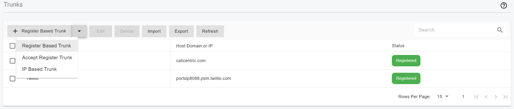
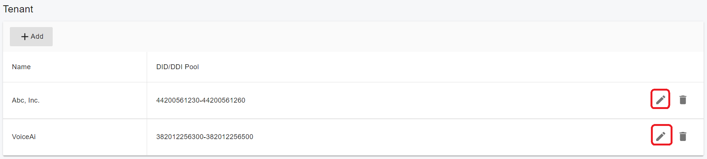

# 7 Trunk 管理

VoIP服务供应商线路，取代传统的电信线路，提供中继服务。供应商可以在一个或多个城市或国家分配本地号码，并将这些号码转给你。在大多数情况下，他们还支持号码移植。

服务供应商能够提供更好的通话费率，因为他们可能有一个国际网络，或者已经协商好更好的费率。因此，使用VoIP供应商可以降低通话成本。

PortSIP PBX支持这些中继线类型。

 + 注册到中继：这种中继需要PBX通过认证ID和密码来注册中继。"**系统管理员**"可以配置一个"**基于注册**"的中继，并将其分配给租户，同时为每个租户分配一个DID号码范围。租户共享该中继线，但有不同的DID号码范围。"**租户管理员**"也可以配置一个"**基于注册的**"中继，但是，这个中继不能与其他租户共享，其主机名和认证ID不能与其他中继相同。

 + 接受中继注册：该中继运营商使用预定义的认证 ID 和密码注册到 PBX。"**系统管理员**"可以配置"**接受注册**"中继，并将其分配给租户，以及为每个租户分配一个DID号码范围。"**租户管理员**"也可以配置一个"**接受注册**"中继，但是，这个中继不能与其他租户共享，其主机名和认证ID不能与其他中继相同。

 + IP认证中继：基于IP认证的中继线一般不要求PBX在中继线上注册。PBX的IP地址需要在中继侧进行配置，这样它就知道打到你号码的电话应该被转到哪里。"**IP认证中继**"中继线只能由"**系统管理员**"来配置，而且基于IP认证的中继线只能添加一次。如果"**系统管理员**"希望允许多个租户使用该中继，"**系统管理员**"可以将该中继分配给多个租户，并为每个租户分配一个DID号码范围。

 + Microsoft Teams：在PortSIP PBX中设置 Microsoft Teams Direct Routing 作为一个中继线。这个中继线只能由"**租户管理员**"配置，不能与其他租户共享。

"**租户管理员**"可以查看"**系统管理员**"分配给他的所有中继，并在此基础上创建接入/外拨规则，但不能更改这些中继。

## 7.1 配置 Trunk

首先，你需要有一个VoIP服务提供商的账户。PortSIP PBX 支持大多数流行的基于SIP的VoIP服务提供商。

当你从VoIP服务提供商那里获得中继线账户后，你需要在PortSIP PBX中配置这个账户



### DID 号码范围

由于 PortSIP PBX 是一个多租户的 PBX，如果多个租户在 PBX 中从同一中继供应商处建立了中继，并在接入规则中设置了相同的 DID 号码，当呼叫到达 PBX 时，PBX 不知道应该将呼叫转接到哪个租户；而当一个租户的分机拨打中继时，将外呼主叫ID设置为属于另一个租户，就会造成问题。

为了解决上述问题，PortSIP PBX引入了 DID号码范围 的概念。

一旦一个租户被"**系统管理员**"分配到中继线，"**系统管理员**"必须为该租户设置一个 DID号码范围 ，该 DID号码范围 不能与其他租户的 DID号码范围 重叠。当租户基于这个分配的中继线创建接入规则时，租户只能使用 DID号码范围 中的DID号码。

如果"**租户管理员**"为自己添加中继，必须为该中继指定一个 DID号码范围 。在添加该中继线后，为该租户创建接入规则时，使用的DID号码必须在这个DID号码范围内。 DID号码范围 不能与同一中继线提供者重叠。

例如，租户A添加了中继供应商XYZ的中继，并将 DID号码范围 设置为1000-2000；租户B也添加了同一中继供应商XYZ的中继，并将DID Pool设置为2000-3000；这将会失败，因为同一中继的 DID号码范围 是重叠的；当2000号的呼叫进入时，PBX不知道应该将呼叫转到哪个租户。

DID 号码范围允许一个单一的号码或一个号码范围，如下所示。

 + 1000-2000
 + 282556000-282556900
 + 101;203;300-450

```
DID号码 和 DID号码范围 不能以"+"、"0"或 "00"开头；如果您的DID号码或 DID号码范围以"+"、"0"或"00"开头，请在输入前删除。
```

### 系统管理员添加Trunk

 1.选择"**通话管理 > SIP中继**"菜单，并点击箭头按钮，选择你需要添加的中继线类型。

 2.为该中继线输入一个友好的名称，并在"**服务器域名/IP**"、"**端口**"、"**Outbound 务器**"和"**Outbound 服务器端口**"字段中填写你从中继线服务提供商那里得到的详细信息。

 3.传输协议，PBX 与中继线通信所使用的传输方式，你应该咨询你的中继线服务商，选择合适的传输方式，目前支持 UDP、TCP 和 TLS。在添加中继线之前，必须在 PBX 中添加该传输协议。例如，如果你的供应商要求使用TCP，你应该在PBX中添加TCP传输，请参考传输协议管理部分。

 4.中继关联IP，对于某些中继线供应商来说，它可能会从多个 IP 向 PBX 发送 INVITE 消息，而不是只从"**服务器域名/IP**"发送。你需要点击"**添加**"按钮，在这里输入每个IP来添加关联的IP。

如果干线类型是"**注册到中继**"，点击"**下一步**"按钮，填写用户名/认证名称、密码和注册时间，从中继提供商获得的帐户详细信息。

点击"**下一步**"按钮，设置更多参数。

1.在 PBX 发送消息给中继时，将 Via 消息头的 IP替换为 PBX 的公网 IP：如果启用该选项，并且PBX有一个公网 IP，那么在向中继站发送SIP消息时，PBX将用PBX的公网IP改变**Via**头的主机IP。除非中继线供应商有要求，否则请保持该选项为默认设置。

2.收到来自中继消息时对源端口进行校验：当PBX收到中继的SIP消息时，试图通过匹配IP和端口来识别中继。如果这个选项被关闭，端口将被忽略。 建议将此值作为默认值。

3.SIP 中继位于 PBX 所在局域网内：如果该中继线不在公共互联网上，请将此选项打开。

4.该中继只接受单个 Via SIP 消息头：如果该选项被打开，PBX在向中继线发送SIP消息时将只保留一个Via头。

5.发送 OPTIONS 消息用于保活：启用后，PBX会向中继线发送保活的消息（SIP OPTIONS）以确定其连接状态（离线或在线）。如果没有收到OPTIONS的200 OK，PBX就会将该中继线标记为离线。

6.发送 OPTIONS 消息的间隔时长（秒）：消息的发送频率，以及何时认为目的地不可用。默认是360秒。

点击"**下一步**"按钮，设置更多参数。

由于该中继线是由"**系统管理员**"添加的，"**系统管理员**"需要选择一个或多个租户，允许他们访问该中继线。

一旦一个租户被分配了中继，必须为该租户设置 DID Pool，如果为多个租户分配了中继，DID Pool 号码不能重叠。

当租户根据这个分配的中继线创建接入规则时，租户只能使用DID Pool中的DID号码。

更多细节请参考DID Pool。



### Admin 权限租户添加Trunk

当 "租户管理员 "登录到网络门户时，他有能力为该租户创建中继。租户管理员 "只能添加下面列出的中继类型。

  + 基于注册。PBX注册到中继线
  + 接受注册。中继线注册到 PBX
  + Microsoft Teams: 微软团队的直接路由

基于IP的 "中继线只能由 "系统管理员 "添加。

1.选择 "呼叫管理器>中继线 "菜单，并点击箭头按钮，选择你需要添加的中继线类型。

2.为该中继线输入一个友好的名称。

3.DID池。必须为该租户指定一个DID池。当基于该中继线为该租户创建呼入规则时，呼入规则中使用的DID号码必须在DID池范围内。更多细节，请参考DID池。

4.在 "主机域或IP"、"端口"、"出站代理服务器"、"出站代理服务器端口 "等字段中，按照你从中继线服务商那里得到的详细信息填写。

5.传输。PBX 与中继线通信所使用的传输方式，你应该咨询你的中继线服务商，选择合适的传输方式，目前支持 UDP、TCP 和 TLS。在添加中继线之前，必须在 PBX 中添加该传输。例如，如果你的供应商要求使用TCP，你应该在PBX中添加TCP传输，请参考传输管理部分。

6.中继线的相关 IP。对于某些中继线供应商来说，它可能会从多个 IP 向 PBX 发送 INVITE 消息，而不是只从 "主机域或 IP "发送。你需要点击 "添加 "按钮，在这里输入每个IP来添加关联IP。

如果干线类型是 "基于注册"，点击 "下一步 "按钮，填写用户名/认证名称、密码和重新注册时间，作为你从干线提供者那里得到的账户细节。

点击 "下一步 "按钮，设置更多参数。

1.在向中继站发送请求时，用PBX服务器的公共IP重写 "Via "头的主机IP：如果启用该选项，并且PBX有一个公共IP，那么在向中继站发送SIP消息时，PBX将用PBX的公共IP改变Via头的主机IP。除非中继线供应商有要求，否则请保持该选项为默认设置。

2.接收中继站的SIP消息时验证端口：当PBX收到中继站的SIP消息时，试图通过匹配IP和端口来识别中继站。如果这个选项被关闭，端口将被忽略。建议将此值作为默认值。

3.该中继线与PBX位于同一局域网内：如果该中继线不在公共互联网上，请将此选项打开。

4.该中继线只接受单个Via的SIP头：如果该选项被打开，PBX在向中继线发送SIP消息时将只保留一个Via头。

5.发送OPTIONS消息以保持活力：启用后，PBX会向中继线发送保持活力的消息（SIP OPTIONS）以确定其连接状态（离线或在线）。如果没有收到OPTIONS的200 OK，PBX就会将该中继线标记为离线。

6.发送OPTIONS消息的时间间隔（秒）：发送消息的频率以及何时认为目的地不可用。默认为360秒

### 配置E1/T1网关注册到PortSIP PBX上

考虑到我们在AWS、AZURE、GCE等云平台上部署了PortSIP PBX，并希望将位于本地LAN的E1/T1网关配置为PortSIP PBX的中继，但E1/T1没有静态公网IP，我们无法将 "认证模式 "配置为 "基于IP "和 "基于注册"。

在这种情况下，我们可以配置E1/T1从本地局域网注册到云端的PortSIP PBX，然后E1/T1可以作为中继线与PortSIP PBX进行通话和接收。

请按照以下步骤完成E1/T1注册到云PortSIP PBX的配置。

1.选择 "呼叫管理器>中继线"，点击箭头按钮，并选择 "接受注册"。

2.为该中继线输入一个友好的名称。

3.DID池。必须为该中继线指定一个DID池。当添加该中继线后，基于该租户创建呼入规则时，使用的DID号码必须在该DID池范围内。更多细节请参考DID池 

4.为 "主机域或IP "输入一个域，这个域不需要现有的域，你可以在这里输入任何域，例如，"portspitrunk1.io"。

```
确保这个域不等于任何租户的SIP域。
```
点击 "下一步 "按钮来设置更多的参数。

1.对于 "授权名称"，你可以在这里输入任何数字，例如 "123456"，E1/T1 网关在注册到 PortSIP PBX 时将使用这个数字进行授权。

2.对于密码，你可以在这里输入任何密码，E1/T1 网关在注册到 PortSIP PBX 时将使用这个密码进行授权。

3.其他设置与上一节配置 "基于IP "和 "基于注册 "中继线的设置相同。

4.在成功添加中继线后，现在你可以配置 E1/T1 网关，让它注册到 PortSIP PBX 上。

5.在E1/T1设置中，将中继线的 "主机域或IP "设置为 "SIP域/SIP服务器"，本例中为 "portsiptrunk1. io"；设置云PBX的公共静态IP为 "出站代理服务器"，设置PortSIP PBX的传输端口为 "出站代理服务器端口"，设置中继的 "授权名称 "和 "密码 "为 "用户名/授权ID/授权名称 "和 "密码"，然后E1/T1网关就可以注册到云PortSIP PBX。

## 7.2 外呼参数和呼入参数

完成中继线的设置后，你也可以到 "呼叫管理器>中继线 "选择一个中继线，并点击 "编辑 "按钮来改变中继线的呼入/呼出参数。

  + 在 "出站参数 "页面，你可以设置一些规则，对发送到中继站的INVITE消息的标题进行修改。例如，"发件人 "SIP头的 "用户 "可以设置为拨打电话的分机的 "出站来电号码"。你可以在用户设置的 "常规 "页面上设置分机的 "呼出号码"，见第5.2节常规。

  + 在 "呼入参数 "页面，用户可以设置规则，对中继线呼入的SIP消息的字段值进行修改。

```
入站和出站参数都是高级选项。建议使用默认值。
```

## 7.3 删除中继

如果仍有基于该中继的入站或出站规则，则不能删除该中继。

  + 如果您想删除一个中继线，您必须将入站和出站规则中的中继线改为另一个中继线。

  + 在删除一个中继线之前，只需删除基于该中继线创建的入站和出站规则。


