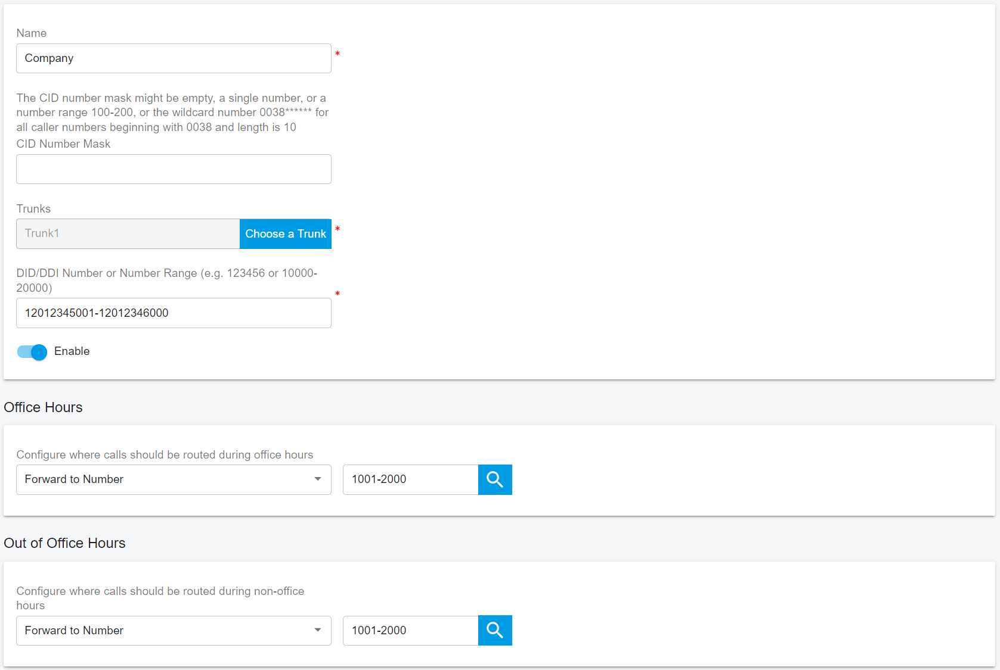

# 8 呼叫路由管理

接入和外拨规则决定 PortSIP PBX 如何根据一些特定的规则来转发路由呼叫。比如，你可以配置一些规则用来控制哪些呼叫需要通过哪个 VoIP运营商/SIP 中继来进行以实现最低的费用。

你也可以基于 DID 号码来创建接入规则以让外部的呼叫直接转发给分机用户，而不用通过 IVR 或者虚拟前台来转接。

## 8.1 创建接入规则

很多公司都给用户或者部门提供"**直拨号码或者DID号码**"以便于可以直接呼叫到用户而不用通过转接。在英国 DID 又称为 DDI，在德国则称为 MSN 号码。

虽然你在公司可以使用虚拟前台来自动应答呼叫，但是使用 DID 直拨号码是更常见的选择，因为它更简单便捷。

用户可以很容易地在"**接入规则**"这里配置 DID 直拨号码。DID 号码是中继或者电话公司提供分配给您的电话线路的虚拟号码，通常是分配一定范围内的一系列号码。具体详情请咨询电话公司或者中继运营商。

在添加接入规则之前，你必须至少配置一条中继线。

要添加接入规则：

1.以 "**System Admin**" 的身份登录 PortSIP PBX Web Portal，点击菜单"**租户**"，选择一个租户，然后点击"**管理**"按钮来管理这个租户，配置接入规则。 或者将一个有租户管理员权限的用户登录到 Web Portal，管理这个租户。

2.从 Web Portal，选择"**通话管理 > 接入规则**"，并点击"**添加**"按钮。

3.为该规则输入一个友好的名称。

4.CID 号码掩码：你可以在这里输入CID号码掩码，PBX 会用它来识别来电者。你可以添加号码的全部内容，识别单个来电者，或者使用 * 作为通配符。例如，```0044**********``` 将识别一个英国来电者，```004420********```将识别一个来自伦敦的来电者。注意：* 的数量必须和实际的号码位数相对应。如果号码是3位数，那么应该使用```***```

  + CID 号码掩码允许使用范围，例如 00442012345670-00442012345680

  + CID 号码掩码可以为空

5.在 SIP 中继，选择你希望与此DID和接入规则相关联的中继，只允许在接入规则中指定一个SIP 中继。

6.在"**DID/DDI号码掩码**"区域，输入DID号码，因为它将出现在SIP"**To**"消息头中（中继提供商的号码已被应用为您的主DID号码或第一个DID号码）。PortSIP PBX 将把这个号码与中继线发送给 PBX 的```SIP INVITE```消息的"**To**"消息头相匹配。

  + DID号码可以是一个单一的数字，如：442012345678
  + DID号码可以是序列号范围，例如：3325261000-3325262000，442012345600-442012345800
  + 单个DID号码或序列号范围必须在中继DID Pool范围内。
  + DID 号码和DID Pool 不能以"**+**"、"**0**"或"**00**"开头；如果您的DID号码或DID池以"**+**"、"**0**"或"**00**"开头，请在输入前删除。

7.指定你希望根据此接入规则转接来电的方式

  + 转移到号码：允许你输入一个号码，然后将呼叫转发到该号码；该号码可以是分机号码或系统分机号码（振铃组、虚拟前台、会议号码、呼叫队列号码）或PSTN 电话号码。该号码也可以是一个范围，例如：2000-3000。如果将"**转移到号码**"字段设置为一个范围，这个范围必须是序列号，"**DID号码掩码**"也必须是一个号码范围，并且两个范围大小必须相等。例如，在"**DID号码掩码**"字段中填入442012345600-442012345800，在"**转移到号码**"字段中设置为1100-1300，如果从中继线打来的电话是442012345600，PBX将把这个电话转到分机1100；如果从中继线打来的电话是442012345698，PBX将把这个电话转到分机1198，这就是1：1映射。
  + 转移到语音邮箱：该呼叫将被路由到语音邮箱服务，以便呼叫者可以留下语音信息。您可以选择语音信箱的分机号码。例如，您选择了108分机，语音留言将被保存在108分机的邮箱中。
  + 挂断：该呼叫将被PBX终止

8.你可以指定，如果一个来电是在办公时间以外收到的，应该以不同的方式进行转接。

9.你可以设置一个接入规则，将大量的DID号码转到大量的分机上。见上面第7点。

## 8.2 接入规则的工作时间

在"**工作时间**"页面，你可以为接入规则设置办公时间，这样呼入的电话就会根据当前的时间被转接到不同的目的地。

如果选择了"**系统默认工作时间**"，PBX 将使用**租户管理员**指定的办公时间。

如果选择了"**自定义工作时间**"，则会采用自定义的办公时间规则。

## 8.3 高级专题: 路由

你可以在同一个中继上创建多条接入规则并使用同一个 DID 号码，但所有这些接入规则必须有不同的CID号码掩码。

例如：你有DID 00442012345670。创建两个接入规则：第一个规则的CID是```0044**********```，DID号码掩码是 442012345670，呼叫被路由到"**队列8000**"；第二个规则的CID是 ```0033*********```，DID号码掩码是 442012345670，呼叫被路由到"**队列9000**"。

现在让英文客服人员登录到队列 8000，法语客服人员登录到队列 9000。当客户拨打 00442012345670，所有来自英国的电话将会被自动接入到队列 8000 与英文客服人员交谈，所有来自法国的电话将会被自动接入到队列 9000 与法语客服人员交谈。


## 8.4 高级专题：将批量号码路由至批量分机

假设一个拥有1000名员工的大公司，从中继服务商那里购买了1000个DID号码，这些DID号码中使用了序列号。如果你给每个员工分配一个DID号码，你的客户可以通过拨打他们的DID号码来联系他们。然而，这是一个几乎很难的分配，因为必须创建1000个入站规则，将1000个DID号码路由到1000个分机（每个雇员是一个分机）。

PortSIP PBX有一个很好的功能，可以让你只用一条接入规则就能实现你的目标。

假设 DID号码是"**0012012345001-0012012346000**"，而员工的分机号码是"**1001-2000**"

1.创建一个接入规则，并将"**DID号码掩码**"字段设置为"**12012345001-12012346000**"

2.将呼叫路由目的地设置为"**1001-2000**"

如果有人拨打"**0012012345001**"，电话将被转到分机"**1001**"，如果拨打"**0012012345005**"，电话将被转到分机"1005"。



## 8.5 创建外拨规则

外拨规则决定了呼出电话将通过哪条中继线被外呼出去。该规则由拨打电话的用户/分机、被呼叫号码的前缀、被呼叫号码长度、或呼叫者所属的用户组决定。

要添加外拨规则：

  + 从 PortSIP PBX Web Portal 菜单中，"**通话管理 > 外拨规则**"并点击"**添加**"按钮，在字段中输入一个新规则的名称。

  + 优先级：设置外拨规则的优先级，如果一个电话符合多个外拨规则，优先级较低的号码具有较高的优先级。

  + 指定触发此外拨规则所对应匹配的标准。在"**规则适用对象**"部分，指定以下任何选项：

    + 被呼叫号码以指定前缀开始的呼叫：将此规则应用于所有以指定号码前缀开始的呼叫。例如，输入"**00**"来指定所有以00开头的号码的呼叫都应触发此规则。呼叫者应该拨打"**00xxx**"来触发这个规则。你可以指定一个以上的前缀，用"**;**"分隔。例如，"00;123;88 "指定了前缀"**00**"和"**123**"以及"**88**"，如果被叫号码匹配其中一个前缀，则会触发该规则

    + 来自指定分机用户的呼叫：可以指定从某个分机用户或者某个分机用户号码段发起的呼叫。指定一个或多个分机，用分号隔开，或者用"-"来指定一个范围。例如，100-120。

    + 被呼叫号码长度：根据被呼叫号码的数字长度来匹配。比如指定为 8，那么所有长度为 8 位的被呼叫号码都将匹配到本规则。可以在不指定被呼叫号码前缀的情况下用来路由本地呼叫和国际长途呼叫

    + 来自指定用户组的呼叫：根据发起呼叫的分机属于哪些分机组来决定是否触发本规则。

  + 现在指定如何用标准来匹配呼出电话。在 "呼出电话 "部分，可以选择最多三条通话路线。每个定义的中继线都会被列为可能的路由。如果第一条路由不可用或者繁忙，PortSIP PBX将自动尝试第二条路由。你可以拖放路由来调整优先级。

  + 你可以通过使用"**截除号码位数**"和"**前缀**"字段，在呼叫被路由到选定的网关或供应商之前，改变符合外拨规则的号码。

    + 截除号码位数：这允许你从被叫号码中删除一个或多个数字。如果不需要的话，使用该选项在呼叫拨到中继或供应商之前删除前缀。例如，如果分机拨打002345，如果你指定要删除两个数字，那么在路由之前，前缀"**00**"将被删除。

    + 前缀：如果供应商或网关要求，这允许你在号码的开头添加一个或多个数字。例如，如果分机拨打002345，我们在"**截除号码位数**"栏中指定2，并将"**前缀**"设置为"+44"，那么PBX 转发给VoIP提供商/SIP Trunk 的最终被叫号码将是+442345。

## 8.6 外拨规则的工作时间

在"**工作时间**"页面，你可以为外拨规则设置办公时间，这样外拨通话可根据当前是否是在工作时间内而设置不同的转发路由

例如，如果当前时间不在指定的工作时间内，即使外拨规则被成功匹配，呼叫也会失败

如果选择"**系统默认工作时间**"，PBX将使用 "**Tenant Admin**" 设置的办公时间

如果选择"**自定义工作时间**"，此外拨规则将使用自定义的办公时间。


