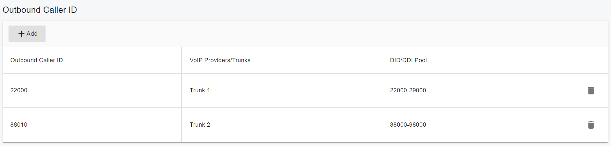

# <center> PortSIP PBX Administration Guide </center>

Version: v16.0.0
Date: Sep 5, 2022

Copyright ©2022, PortSIP Solutions, Inc. All rights reserved. No part of this document may be reproduced, translated into another language or format, or transmitted in any form or by any means, electronic or mechanical, for any purpose, without the express written permission of PortSIP Solutions, Inc.


## Copyright Notice

Copyright© 2022 PortSIP Solutions, Inc.
All rights reserved.
Any technical documentation that is made available by PortSIP Solutions, Inc. is proprietary and
confidential and is considered the copyrighted work of PortSIP Solutions, Inc.
This publication is for distribution under PortSIP non-disclosure agreement only. No
part of this publication may be duplicated without the express written permission of
PortSIP Solutions, Inc.
PortSIP reserves the right to make changes without prior notice.

## Trademarks

 

PortSIP®, the PortSIP logo and the names and marks associated with PortSIP products are trademarks and/or service marks of PortSIP Solutions, Inc. and are registered and/or common law marks in the United States and various other countries. All other trademarks are property of their respective owners. No portion hereof may be reproduced or transmitted in any form or by any means, for any purpose other than the recipient's personal use, without the express written permission of PortSIP.

## End User License Agreement

By installing, copying, or otherwise using this product, you acknowledge that you have read, understand and agree to be bound by the terms and conditions of the [PortSIP End User License Agreement](https://support.portsip.com/license-agreement/portsip-software-end-user-license-agreement) for this product.

## Open Source Software Used in this Product

This product may contain open source software. You may receive the open source software from PortSIP up to three(3) years after the distribution date of the applicable product or software at a charge not greater than the cost to PortSIP of shipping or distributing the software to you.

## Disclaimer

While PortSIP uses reasonable efforts to include accurate and up-to-date information in this document, PortSIP makes no warranties or representations as to its accuracy. PortSIP assumes no liability or responsibility for any typographical or other errors or omissions in the content of this document.

## Limitation of Liability

PortSIP and/or its respective suppliers make no representations about the suitability of the information contained in this document for any purpose. Information is provided “as is” without warranty of any kind and is subject to change without notice. The entire risk arising out of its use remains with the recipient. In no event shall PortSIP and/or its respective suppliers be liable for any direct, consequential, incidental, special, punitive or other damages whatsoever (including without limitation, damages for loss of business profits, business interruption, or loss of business information), even if PortSIP has been advised of the possibility of such damages.

## Summary of Changes

### Changes for Release v16.0.0

The following changes are included in this release:

- Rewrite all REST API

## About This Guide

This document provides guidelines to help facilitate the administration of the
PortSIP PBX Unified Communications solution. It includes important sections detailing installation, administration, and upgrade procedures in particular for the admin mode.
Where applicable, it lists and references other guides that contain detailed information on administrative procedures for BroadWorks servers or client applications.

## Overview

PortSIP PBX is a modern, complete Unified Communications solution, providing a
comprehensive suite of services addressing both business and consumer needs. The solution includes the following features:

- Multi Tenant
- Dealers Management
- Audio Calling and Video Calling
- Conferencing
- Instant Messaging and Presence (IM&P)
- Voice and Video Messages
- File and Picture Share
- Service Management (call settings)
- Audio and Video Call Recording
- Recordings Management
- Desktop Share
- Address Books/Contact Management
- Push Notifications
- Billing
- Virtual Receptionst
- Ring Group
- Contact Center
- Queue Callback
- Call Report
- Call Park
- Music On Hold
- Call Pickup Group
- Voicemail and Shared Voicemail
- Automatic Callback
- WebRTC
- Microsoft Teams Direct Routing
- Integrated SBC
- Full Opened REST API
- Zero Touch Provisioning
- Custom Template
- Role and Permissions
- Trunk Management
- Centralized Service Configuration (Call Forwarding, Do not Disturb, and so on).
- Troubleshooting
- Free Client VoIP SDK
- Free Client apps

## 1 Architecture

 

## 2 Install PortSIP PBX

### 2.1 Install PortSIP PBX and SBC for Linux

#### Supported Linux OS

- CentOS: 7.9
- Ubuntu: 18.04, 20.04, 22.04
- Debian: 10.x, 11.x

It only supports 64bit OS.

#### Preparing the Linux Host Machine for Installation

Tasks that MUST be completed before installing PortSIP PBX.

- If the Linux on which PBX will be installed is located in LAN, assign a `static LAN IP address`; if it's in a public network, please assign a `static IP address` for the public network.
- Install all available updates & service packs before installing PortSIP PBX.
- Do not install PostgreSQL on your PortSIP PBX Server.
- Ensure that all power-saving options for your System and Network adapters are disabled (by setting the system to High Performance).
- Do not install TeamViewer, VPN, and other similar software on the host machine.
- PortSIP PBX must not be installed on a host which is a DNS or DHCP server.
- Below ports must be permitted by your firewall.
  - UDP: 5060, 25000 - 35000, 45000 – 65000
  - TCP: 5065, 8883, 8885, 8887, 8888
    Please also ensure the above ports have not been used by other applications.
- Ensure server date-time is synced correctly
- Must execute all Linux commands by the root user, please su root first.

> **Warning**
> If the PBX running on a cloud platform such as AWS, and the cloud platform has the firewall itself, you MUST open the ports on the cloud platform firewall too.

#### Step 1 Download installation scripts

Execute the below commands to download the installation scripts.

```shell
mkdir /opt/portsip && cd /opt/portsip
curl https://raw.githubusercontent.com/portsip/portsip-pbx-sh/master/v16.x/install_pbx_docker.sh     -o  install_pbx_docker.sh
curl https://raw.githubusercontent.com/portsip/portsip-pbx-sh/master/v16.x/portsip_pbx_ctl.sh        -o  portsip_pbx_ctl.sh
```

### Step 2 Setup the docker environment

Execute the below command to install the `Docker-Compose` environment.

```shell
/bin/sh install_pbx_docker.sh
```

### Step 3 Create and run the PortSIP PBX docker container instance

The below command is used to create and run the PBX on a server which the IP is `66.175.221.120`.

```shell
/bin/sh portsip_pbx_ctl.sh run -p /var/lib/portsip -a 66.175.221.120 -i portsip/pbx:16
```

If run the PBX in a LAN without public IP, just replace the `66.175.221.120` by private IP of the PBX server,.

Now you can use `https://66.175.221.120:8887` or `https://66.175.221.120:8888` to access the PBX Web portal, the default system administrator name and password both are `admin`.

### Step 4 Setup the PortSIP SBC

PortSIP also provide a SBC that supports the WebRTC clients and Microsoft Teams Direct Routing.

The PortSIP SBC can be act as a componet of the PortSIP PBX to provide the WebRTC and MS Teams Direct Routing feature. It's also can be setup alone that works with other 3rd PBX.

Execute the below commands to download the installation scripts.

```shell
curl https://raw.githubusercontent.com/portsip/portsip-pbx-sh/master/v16.x/install_sbc_docker.sh     -o  install_sbc_docker.sh
curl https://raw.githubusercontent.com/portsip/portsip-pbx-sh/master/v16.x/portsip_sbc_ctl.sh        -o  portsip_sbc_ctl.sh
```

The below command is used to create and run the SBC on the PBX server together.

```shell
/bin/sh portsip_sbc_ctl.sh run -p /data/portsip -i portsip/sbc:10
```

Now you can use `https://66.175.221.120:8883` to access the PBX Web portal, the default system administrator name and password both are `admin`.

### 2.2 Configue PortSIP PBX

After the PortSIP PBX has been installed successfully, use your browser to access the web portal at https://66.175.221.120:8887. The sign-in page looks like the one in the screenshot below.

 

 Just sign in by enter the username and password both are `admin`， leave the domain as blank.

 After singed in the web portal, the `Setup Wizard` will pop ups automtically if you are not completed it yet, some settings must be configred in order to make the PBX works.

#### 2.2.1 Setup Wizard 1: Network Environment

Enter the Public IPv4 if you have a static public IP of your LAN. Do not enter the Public IPv4 if your public IP is dynamic.
Note: the loopback interface (127.0.0.1) is unacceptable. Only the static IP for LAN where the PBX is located is allowed (do not use DHCP dynamic IP). This private IP must be reachable by your SIP client.
The IP address entered here is the SIP server IP address for PBX. It is required when a SIP client or IP phone registers to PortSIP PBX should be configured as the `Outbound Proxy Server`.

> **Note**
> If the PBX is located on the cloud, both of the `private IPv4` and `public IPv4` should be entered here. If located in LAN, just enter the `private IPv4` only.


#### 2.2.2 Setup Wizard 2: Certificate File

In order to support TLS transport for SIP, and provide HTTPS access for the Web Portal and REST API, we must have a trusted SSL certificate and upload to PBX in this step.

You will need have a web domain, for example, purchase a domian from domain provider such as Godaddy, and resolve it to your PBX IP.

You will also need to purchase a trusted SSL certificate for this domain to avoid the browser warning. Ther certifiate provider Digicert, GeoTrust, Godaddy or other certificates providers are recommended.

If you don't have the domain or certificate, you can simply enter the PBX IP as the Web Domain, and accept the default certificate here. By the default, the PortSIP PBX use a self-sigend certificate, it will cause the browser to block connection and pop ups the warning informaiton.

##### Purchase SSL certificate

You can follow below steps if you would like to purchase certificate files from a trusted provider (assume purchased certificate for domain mypbx.com):

- Generate the CSR file and private key file according to provider’s guide, and keep
the files. Suggest don't set password for the private key file.
- Rename the private key file as portsip.key
- Submit the CRS file to provider, and download the certificate files after your certificates approved. This step will end up with two files:
  - Intermediate CA certificate
  - SSL certificate
- Use a plain text editor for example Windows Notepad (do not use MS Word) to open the Intermediate CA file and SSL certificate file, copy the Intermediate CA contents to append to the SSL certificate file, and rename SSL certificate file as portsip.pem.

Now you have two certificate files:

- portsip.key
- portsip.pem
  
Now enter the `mypbx.com` for `Web Domain` field; clean the `Certificate File` filed and use the Winows Notepad to open `portsip.pem` file, copy all contents and paste to `Certificate File` filed; clean the `Private Key` filed, and use the Winows Notepad to open `portsip.key` file, copy all contents and paste to `Private Key` filed.


#### 2.2.3 Setup Wizard 3: Transport Protocol

You can set transport layer protocol for the SIP signaling by clicking the `Add` buton.
By default, the transport ports are:

- UDP: 5060
- TCP: 5063
- TLS: 5061

You can feel free to change the default port to a new port which you prefer, but the port should be not used by other applications.


> **Warning**
> Once you added the transport, you have to chagne the firewall rule to allow the transport port. The client app, IP Phone will reach to PBX by the transport and port.

## 3 PBX Management

After completing the Configuration Wizard, you may manage PortSIP PBX in the Web Portal.

### 3.1 Tenant Management

PortSIP PBX is designed as Multi-Tenant, which means one PortSIP PBX installation can work for multiple enterprise (companies) by creating more than one tenants, and each tenant will be able to have their own PBX system.

#### 3.1.1 Creating Tenant

To create a new tenant, select the left menu `Tenants` and click the `Add`.
When creating a tenant, you can specify the tenant profile details such as `Name`,
`sip domain`, `office hours` and `Storage`. A tenant profile can be modified after tenant admin signing into the Web Portal.
You can also limit the resource the tenant uses by clicking the `Options` tab. The `Capability` section under this tab allows you to set the maximum extensions, maximum concurrent calls, maximum ring groups etc.

##### In the `General` tab allows to set below parameters

- Name: The name for identify that tenant, for example `TenantA`.
- SIP Domain: The SIP domain for this tenant, it should be unique, the extensions of this tenant SIP URI should be: `sip:xxx@domain.com`.
- Enable this Tenant: If this option is deselected, this tenant will be disabled, and
all extensions of this tenant will no longer be valid.
- Extension is not allowed to delete recordings: If it's selected, the extension
can't delete the recording files even if he signs in the PBX Web Portal.
- Allow concurrent logins: If this option is selected, the tenant can sign in Web
Portal from multiple devices. If deselected, once tenant signs in, the login in
another PC/mobile phone will be invalid.
- Allow extension to create temporary meeting: If selected, the extensions of
this tenant will be able to create temporary meetings via REST API.

##### In the `Options` tab allows to set below parameters

- Country: The country for the tenant
- Timezone: The timezone for the tenant
- Currency: The currency for the tenant
- Enable queue blacklist first level: Enable the level 1 of queue blacklist
- Enable queue blacklist first leve2: Enable the level 2 of queue blacklist
- Billing for all inbound calls: enable billing for inbould calls
- Billing for all outbound calls: enable billing for outbound calls
- Enable extension to modify personal SIP password: If selected, the extension
will be able to modify his SIP password
- Enable extension audio recording: If selected, audio calls of all extensions will
be recorded even if the extension not enabled recording in its profile.
- Enable extension video recording: If selected, video call of all extensions will
be recorded even if the extension not enabled recording in its profile.
- Capability: Used to set the capabilities for the tenant

The `Storage` tab allows to adjust the storage quota for Recording files, Voice Mails and the Call Reports:

- Disk quota (MB): The maximum disk quota allowed for this tenant
- Recordings: Current disk usage of recordings for this tenant
- Voice Mails: Current disk usage of voice mails for this tenant

You can set the way of deleting old recording files and voice mails in `Auto cleaning` section.

#### 3.1.2 Deactivating Tenant

To deactivate an existing tenant, select the left menu `Tenants`, and all tenants will be listed. Click the ON/OFF button in the `Status` column to deactive/activate that tenant.

#### 3.1.3 Deleting Tenant

To deactivate an existing tenant, select the left menu `Tenants`, and all tenants will be listed. Select a tenant then click the `Delete` button to delete it.

#### 3.1.4 Managing Tenant

PortSIP allows System administrator to manage tenant and its settings including extension users.
Todo this, please go to Web Portal, navigate to `Tenant` menu, select a tenant to be managed and click `Manage` button, now system admin may setup or modify the settings for the tenant and manage its extensions.
Once completed, user may click profile picture on the top right of page to display the menu and choose `Switch to Administrator` to switch back to system administrator, without the need to logout of tenant account and re-login to administrator account.

### 3.2 Phone Device Management

### 3.3 Extension Management

This section explains how to create and configure extensions in PortSIP PBX. There are
multiple methods to create an extension.

- When provisioning a new phone, you could choose to create a new extension for that pone.
- Extensions can be manually created from the left menu `Call Manager > Extensions`.
- Extensions can be imported from a .csv file.
- Create the extension by calling REST API.
  
To configure an extension, click on `Call Manager > Extensions` in the PortSIP PBX Web
Portal. Click on `Add` to create a new one, or select an existing extension and click the `Edit` button to configure or manage the existing extension users.

#### User

In this section of `User`, you can enter the `username` and `password`, please note, this is just for the web portal accessing.

In the `Role` list box, the user can grant permissions by choose a role, the `User` role means normal extension; The `Admin` role means this user is also have tenant administrator role, have the premissions to manage the tenant by sign in web port. There allows create more than one administrator for a tenant.

The `Email` filed is required, since the PBX will need to send the notifiy email to user's email.

The `Display Name` is the full name of the user, likes `James Bond`.

#### General

In the section of `General`, you can enter the extension number, password. The extension number can be numerals or letters; the extension number and password are required. A welcome email with information on the extension created, as well as voicemail will be sent to the user's email address.

If the SMTP server of tenant is configured, once an extension is successfully created and the its email is set, PortSIP PBX will send an email to the extension's email which includes the extension information and PBX parameters such as PBX SIP Domain, PBX IP, and the QR code. User can use the PortSIP UC App to scan the QR code to register to PBX without enter the details.

There is a QR code for this extension, you can use PortSIP App to scan the QR code to sign in the PBX rather than entering the information manually.

In the `Outbound Caller ID` section, you can select a DID base the trunk and trunk DID pool for the extension, once the extension makes outbound call to a trunk, the `Outbound Caller ID` will be present in the INVITE SIP message.

As the below screenshot, when the call is via trunk 1, the outbound caller ID `22000` will be used, and the outbound caller ID `88010` will be used if the call is over the trunk 2.



- Record audio calls: if this option is enabled, the PBX will record this extension audio calls. If the call is for video, the PBX will only record it as an audio file.
- Record video calls: if this option is enabled, if this extension make audio call, the call will be recorded as an audio file, and will record the video call as a video file(MP4).
- Always make outbound anonymous calls: once this option is enabled, the `anonymous` will be set as the user part of `From`, `P-Asserted-Identity`, and `P-Preferred-Identity` headers in the `INVITE` message when make call to trunk.  
- Always delivery outbound caller ID: if this option is enabled, the `Outbound Caller ID` will be always set as user part of the `From` header in the INVITE which sent to the trunk.

#### Forwarding Rule

Each extension can have a set of call forwarding rules that define what PortSIP PBX should do when the extension user is unable to answer an incoming call. This can be configured on the basis of following:

- The user’s status
- The time

Each status requires a call-forwarding rule. For example, if the user is unable to take a call whilst their status is  `Available`, the call can forward to voicemail or to the mobile phone number / Landline .

> **Note**
> Forwarding the call to certain mobile number requires the trunk and outbound rule configured.

The forwarding rules have the below optional values.

- Forward to voicemail: the call will be forwarded to the voicemail service in order to let the caller leave a voice message. There allows to choose an extension nubmer for the voicemail box. For example, choose extension 108, the voicemail will be saved into the 108's mailbox; Leave it as empty the voicemail will be saved into the extensioin itself maibox.
- Forward to number: allows to enter a number then the call will be forwared to this number, the nubmer can be an extension number or a PSTN phoen number.
- Hangup: the call will be hangup by PBX.
- Ring anyway: send the call to this extension anyway.
- Exceptions: create exceptions by entering the `Caller ID`, selecting the time frame in
`Received During` and choose the action in `Action` to bypass the extension forward rules.

#### Voicemail

The `Voicemail` tab allows you to configure the extension’s voice mail preferences (including the voicemail PIN number for authentication), enable/disable PIN Authentication, and enable PortSIP PBX to read out the Date/Time on which the
message was received.

In the `Greetings for Voicemail` section allows you to configure your voicemail greetings.

Click the `+` button to upload the new greeting file, and click the `Lock` icon to specify it as greeting file.

#### Office Hours

The Office Hours Scheduling feature allows a user’s status to be changed on the base of
global office hours or specific office hours.

Select if the extension would follow the Global Office Hours, or use Specific Office Hours. To specify Specific Office Hours, chose the `Use specific Office Hours` option,  then you can create multiple office hours for every day.

The time frame `00:00 - 23:59` means whole day is office hours, and `00:00 - 00:00` means whole day is closed.

#### Phone Provisioning

The `Phone Provisioning` tab allows you to add or edit settings of phones linked to this
extension. The management of IP phone settings is discussed in section `3.2 Phone Device Management`.

#### BLF

You can configure the BLF lights on an IP Phone in this tab.

Match a BLF button with an extension, so that this button will show the status of that extension.
The number of available BLF buttons varies per phone.
The following options are available for BLFs.

- BLF: shows presence of another extension
- BLF New Call: start a new call to a number
- BLF A Transfer: start the attended transfer
- BLF B Transfer: start the blind transfer
- Visual Park: the unique park feature that PortSIP PBX offered, get more details in section `Call Park`.
- Speed Dial: link to a phone number for easy calling
- Custom Speed Dial
- Change Status

#### Balance

The tenant administrator can set the balance for an extension. When billing is enabled and the balance is not enough the call will fails.

