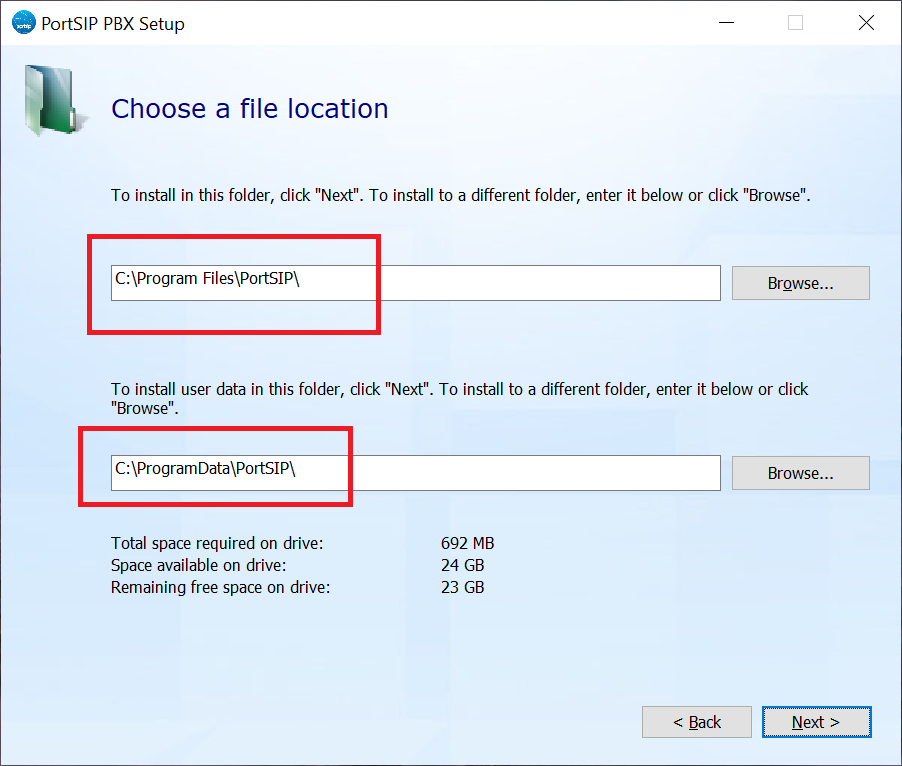
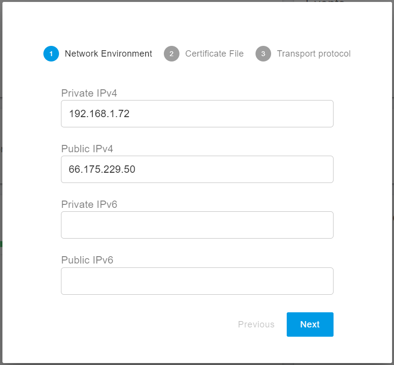
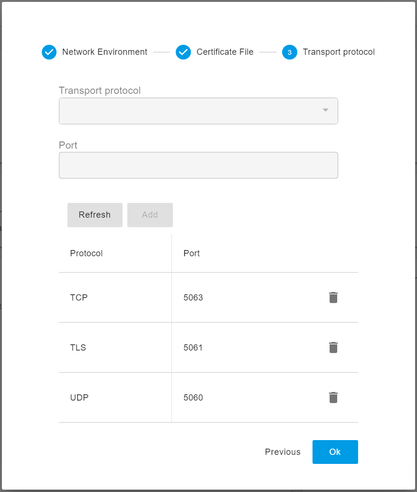
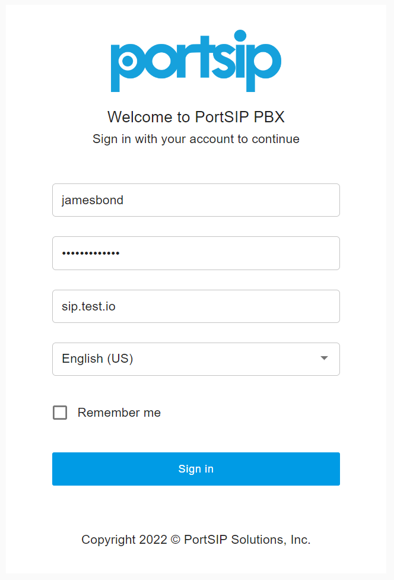
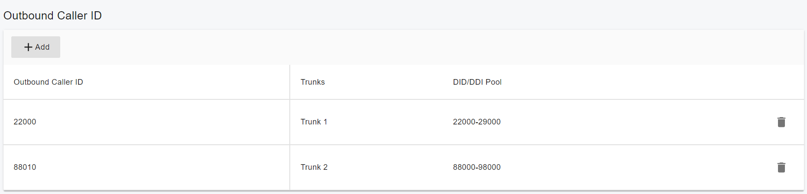
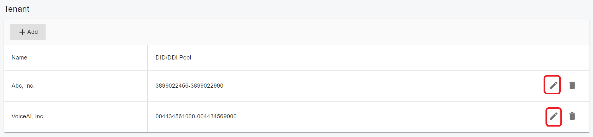
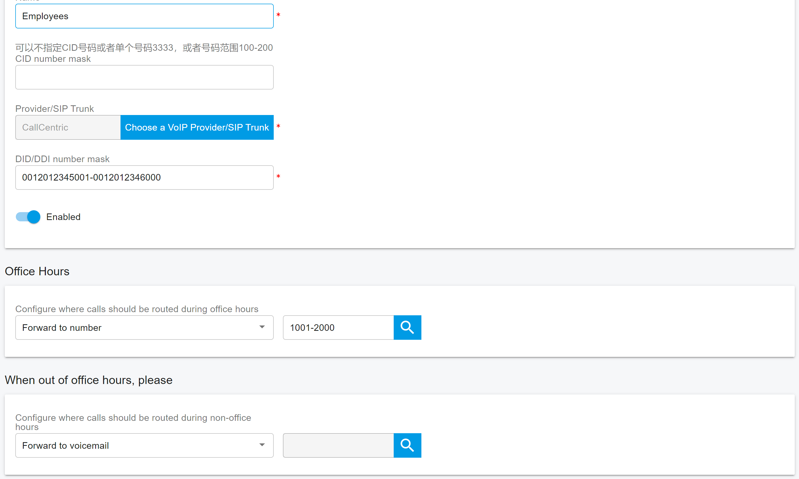
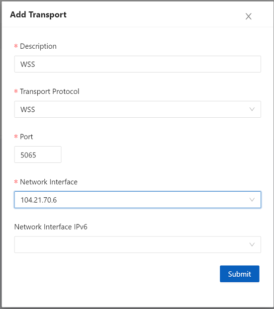
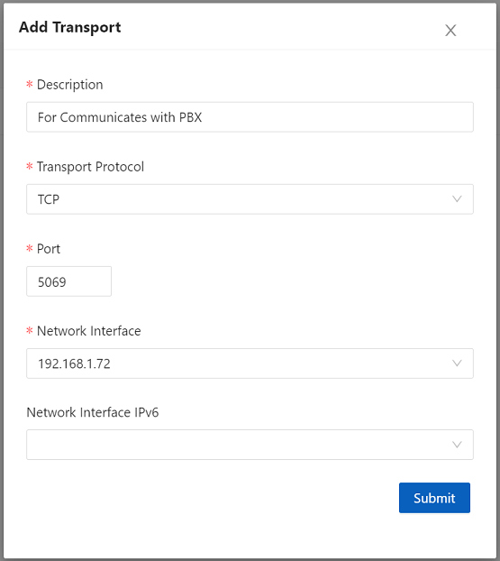

# <center> PortSIP PBX Administration Guide </center>

Version: v16.0.0
Date: Sep 5, 2022

[toc]

## Copyright Notice

Copyright© 2022 PortSIP Solutions, Inc.
All rights reserved.
Any technical documentation that is made available by PortSIP Solutions, Inc. is proprietary and
confidential and is considered the copyrighted work of PortSIP Solutions, Inc.
This publication is for distribution under PortSIP non-disclosure agreement only. No
part of this publication may be duplicated without the express written permission of
PortSIP Solutions, Inc.
PortSIP reserves the right to make changes without prior notice.

## Trademarks

 

PortSIP®, the PortSIP logo and the names and marks associated with PortSIP products are trademarks and/or service marks of PortSIP Solutions, Inc. and are registered and/or common law marks in the United States and various other countries. All other trademarks are property of their respective owners. No portion hereof may be reproduced or transmitted in any form or by any means, for any purpose other than the recipient's personal use, without the express written permission of PortSIP.

## End User License Agreement

By installing, copying, or otherwise using this product, you acknowledge that you have read, understand and agree to be bound by the terms and conditions of the [PortSIP End User License Agreement](https://support.portsip.com/license-agreement/portsip-software-end-user-license-agreement) for this product.

## Open Source Software Used in this Product

This product may contain open source software. You may receive the open source software from PortSIP up to three(3) years after the distribution date of the applicable product or software at a charge not greater than the cost to PortSIP of shipping or distributing the software to you.

## Disclaimer

While PortSIP uses reasonable efforts to include accurate and up-to-date information in this document, PortSIP makes no warranties or representations as to its accuracy. PortSIP assumes no liability or responsibility for any typographical or other errors or omissions in the content of this document.

## Limitation of Liability

PortSIP and/or its respective suppliers make no representations about the suitability of the information contained in this document for any purpose. Information is provided "as is" without warranty of any kind and is subject to change without notice. The entire risk arising out of its use remains with the recipient. In no event shall PortSIP and/or its respective suppliers be liable for any direct, consequential, incidental, special, punitive or other damages whatsoever (including without limitation, damages for loss of business profits, business interruption, or loss of business information), even if PortSIP has been advised of the possibility of such damages.

## Summary of Changes

### Changes for Release v16.0.0

The following changes are included in this release:

- Rewrite all REST API

## About This Guide

This document provides guidelines to help facilitate the administration of the
PortSIP PBX Unified Communications solution. It includes important sections detailing installation, administration, and upgrade procedures in particular for the admin mode.
Where applicable, it lists and references other guides that contain detailed information on administrative procedures for BroadWorks servers or client applications.

## Overview

PortSIP PBX is a modern, complete Unified Communications solution, providing a
comprehensive suite of services addressing both business and consumer needs. The solution includes the following features:

- Multi Tenant
- Dealers Management
- Audio Calling and Video Calling
- Conferencing
- Instant Messaging and Presence (IM&P)
- Voice and Video Messages
- File and Picture Share
- Service Management (call settings)
- Audio and Video Call Recording
- Recordings Management
- Desktop Share
- Address Books/Contact Management
- Push Notifications
- Billing
- Virtual Receptionst
- Ring Group
- Contact Center
- Queue Callback
- Call Report
- Call Park
- Music On Hold
- Call Pickup Group
- Voicemail and Shared Voicemail
- Automatic Callback
- WebRTC
- Microsoft Teams Direct Routing
- Integrated SBC
- Full Opened REST API
- Zero Touch Provisioning
- Custom Template
- Role and Permissions
- Trunk Management
- Centralized Service Configuration (Call Forwarding, Do not Disturb, and so on).
- Troubleshooting
- Free Client VoIP SDK
- Free Client apps

## Before Started

### Prerequisite Knowledge for Linux

Deploying PortSIP PBX in a Linux environment requires planning and knowledge of session
initiation protocol (SIP) audio, video call and presence, Instant Messaging (IM) administration.

You should also have knowledge of the following Linux infrastructures:
A popular Linux distribution:

- CentOS 7.9 (64-bit)
- Debian 10.x (64-bit)
- Ubuntu 18.04 or 20.04 (64-bit)
- Docker 20.10 or higher
- IPv4/IPv6
- Systemd
- IP tables
- Firewalld
- HTTP

This document assumes that the Linux OS is already depoyed and administrators of PortSIP
PBX have been allocated with the root permission to Linux.

### Prerequisite knowledge for Windows

Deploying PortSIP PBX in a Windows environment requires planning and knowledge of
session initiation protocol (SIP) audio, video call and presence, Instant Messaging (IM)
administration. You should also have knowledge of the following Windows infrastructures:

A Windows desktop or Windows server OS:

- Windows 10/11 (64-bit)
- Windows Server 2012/2016/2019/2020/2022
- IPv4/IPv6
- Windows firewall

This document assumes that the Windows OS is already deployed and administrators of
PortSIP PBX have been allocated with the administrator permission to Windows.

### Cloud and Virtualization Environment Supported

To build high-availability communication solution to help clients reducing cost and improving communication performance, PortSIP PBX commits support on cloud services and have confirmed compatibility with following cloud and virtualized environment:

- VMware ESX 5.X and above.
- Linux HyperV
- Microsoft HyperV 2012 R2 and above
- Microsoft AZURE
- Amazon AWS
- Google Could
- Digital Ocean
- ALI Cloud

### System performance depends on following key factors

- Maximum simultaneous calls needed for PBX
- Maximum online users needed for PBX
- Recordings for calls
- Recording audio only or both of audio and video
- Maximum online users for audio/video conferences on PBX
- Maximum IVRs (Virtual Receptionist) on PBX
- Maximum Call Queues on PBX
- Maximum Ring Groups on PBX

Depending on the key features listed above, PortSIP PBX is able to run on PCs and servers with various CPUs ranging from Intel i3 CPUs to Xeon.

### Other Requirements

- Latest Firefox, Google Chrome, Edge browser
- Microsoft .NET Framework version 4.5 or higher
- Knowledge of Linux and Linux Internet administration
- Knowledge of Windows and Windows Internet administration
- A constant Internet connection to stun4.l.google.com on port 19302
- Ensure server date time is synced correctly.

### FQDN Support

Although PortSIP PBX is designed to be able to run on servers without FQDN specified, we
recommend to specify FQGN with following advantages:

- Easier access to Web Portal for PortSIP PBX
- Easier management of IP phones and clients after IP address change for PBX
- Convenient access to HTTPS when accessing Web Portal
- Avoid browser warning when access the WebRTC Client

The FQDN you are using must be able to be resolved correctly into the server with PortSIP PBX installed in LAN. If PortSIP PBX is installed on public network, FQDN must be resolved correctly into the public network address for server with PBX installed.

### Getting Help and Support Resources

[Official PortSIP Support Community](https://forum.portsip.com/)
[PortSIP Knowledge Base](https://www.portsip.com/knowledge-base/)
[Submit a request](https://portsip.zendesk.com/hc/en-us/requests/new)
[Email support](mailto:support@portsip.com)

## 1 Architecture


## 2 Installation of PortSIP PBX

### 2.1 Downloading PortSIP PBX

The latest free edition of PortSIP PBX could always be found and downloaded at [PortSIP Website]([https://www.portsip.com](https://www.portsip.com/)). It’s available for both 64-bit Windows and Linux, but not for 32-bit version.

The free edition of PortSIP PBX offers a maximum of 3 simultaneous calls and 10 extension registrations. If you require more simultaneous calls/extensions, please refer to [License Section](#11.10 License) for more details.

You will get the installer after download completed.

### 2.2 Installing PortSIP PBX on Linux

#### Supported Linux OS

- CentOS: 7.9
- Ubuntu: 18.04, 20.04, 22.04
- Debian: 10.x, 11.x

It only supports 64bit OS.

#### Preparing the Linux Host Machine for Installation

Tasks that MUST be completed before installing PortSIP PBX.

- If the Linux on which PBX will be installed is located in LAN, assign a `static LAN IP address`; if it's in a public network, please assign a `static IP address` for the public network.
- Install all available updates & service packs before installing PortSIP PBX.
- Do not install PostgreSQL on your PortSIP PBX Server.
- Ensure that all power-saving options for your System and Network adapters are disabled (by setting the system to High Performance).
- Do not install TeamViewer, VPN, and other similar software on the host machine.
- PortSIP PBX must not be installed on a host which is a DNS or DHCP server.
- Below ports must be permitted by your firewall.
  - UDP: 5060, 25000 - 35000, 45000 – 65000
  - TCP: 5065, 8883, 8885, 8887, 8888
    Please also ensure the above ports have not been used by other applications.
- Ensure server date-time is synced correctly
- Must execute all Linux commands by the root user, please su root first.

> **Warning**
> If the PBX running on a cloud platform such as AWS, and the cloud platform has the firewall itself, you MUST open the ports on the cloud platform firewall too.

#### Step 1 Download installation scripts

Execute the below commands to download the installation scripts.

```shell
mkdir /opt/portsip && cd /opt/portsip
curl https://raw.githubusercontent.com/portsip/portsip-pbx-sh/master/v16.x/install_pbx_docker.sh     -o  install_pbx_docker.sh
curl https://raw.githubusercontent.com/portsip/portsip-pbx-sh/master/v16.x/portsip_pbx_ctl.sh        -o  portsip_pbx_ctl.sh
```

#### Step 2 Setup the docker environment

Execute the below command to install the `Docker-Compose` environment.

```shell
/bin/sh install_pbx_docker.sh
```

### Step 3 Create and run the PortSIP PBX docker container instance

The below command is used to create and run the PBX on a server which the IP is `66.175.221.120`.

```shell
/bin/sh portsip_pbx_ctl.sh run -p /var/lib/portsip -a 66.175.221.120 -i portsip/pbx:16
```

If run the PBX in a LAN without public IP, just replace the `66.175.221.120` by private IP of the PBX server,.

Now you can use `https://66.175.221.120:8887` or `https://66.175.221.120:8888` to access the PBX Web portal, the default system administrator name and password both are `admin`.

### Step 4 Setup the PortSIP SBC

PortSIP also provide a SBC that supports the WebRTC clients and Microsoft Teams Direct Routing.

The PortSIP SBC can be act as a componet of the PortSIP PBX to provide the WebRTC and MS Teams Direct Routing feature. It's also can be setup alone that works with other 3rd PBX.

Execute the below commands to download the installation scripts.

```shell
curl https://raw.githubusercontent.com/portsip/portsip-pbx-sh/master/v16.x/install_sbc_docker.sh     -o  install_sbc_docker.sh
curl https://raw.githubusercontent.com/portsip/portsip-pbx-sh/master/v16.x/portsip_sbc_ctl.sh        -o  portsip_sbc_ctl.sh
```

The below command is used to create and run the SBC on the PBX server together.

```shell
/bin/sh portsip_sbc_ctl.sh run -p /data/portsip -i portsip/sbc:10
```

You also need to open the port that you are using for adding new transport:

- Assume you have added a TLS transport on port 5063, you must open TCP port 5063 in your Linux Firewalld.
- Assume you have added a TCP transport on port 5061, you must open TCP port 5061 in your Linux Firewalld.
- Assume you have added a UDP transport on port 5068, you must open UDP port 5068 in your Linux Firewalld.

> **Warning**
> If the PBX running on a cloud platform such as AWS, and the cloud platform has the firewall itself, you MUST open the new transport port on the cloud platform firewall too.

### 2.3 Installing PortSIP PBX on Windows

#### Preparing the Windows Host Machine for Installation

Tasks that MUST be completed before installing PortSIP PBX.

- If the Windows PC / server on which PBX will be installed is located in LAN, assign a static LAN IP address; if it's in public network, assign a static IP address for public network.
- Install all available Windows updates & service packs before installing PortSIP PBX. The reboot after installing Windows updates may reveal additional updates. Pay particular attention to install all updates for Microsoft .Net before running the PortSIP PBX installation.
- Anti-virus Software should not scan the following directories to avoid complications and write access delays: `C:\Program Files\PortSIP`; `C:\Programdata\PortSIP`
- Do not install VPN, TeamViewer software on your PortSIP PBX Server
- Do not install `PostgreSQL` on your PortSIP PBX Server
- Ensure the `**Windows Firewall**` service has been started.
- Ensure that all power saving options for your System and Network adapters are disabled (by setting the system to High Performance).
- Disable Bluetooth adapters if it is a Windows client PC.
- PortSIP PBX must not be installed on a host which is a DNS or DHCP server, or that has MS SharePoint or Exchange services installed.
- Below ports must be permitted by your firewall.
  - UDP: 5060, 25000 - 35000, 45000 – 65000
  - TCP: 5065, 8883, 8885, 8887, 8888
    Please also ensure the above ports have not been used by other applications.
- Ensure server date-time is synced correctly
- Ensure your Windows Firewall is enabled

> **Warning**
> If you running the PBX on the cloud platform such as AWS, and the cloud platform has the firewall itself, you MUST open the ports on the cloud platform firewall too.

#### Installing a fresh PortSIP PBXfor Windows

To install PortSIP PBX, you only need to double-click the installer, which will guide you through the installation process.

PortSIP PBX services will automatically start after successful installation (and there after every time your computer starts up).

> **Warning**
> During installation, when you choose the folders for the PBX, below two folders must not same!!



#### Configuring Windows Firewall Rules

After having successfully installed PortSIP PBX, the PortSIP PBX ports has been opened with Linux firewall.

If your server has a firewall which is blocking the ports, you must open the below ports in order to make the PortSIP PBX working properly.

- Below ports must be permitted by your firewall.
  - UDP: 5060, 25000 - 35000, 45000 – 65000
  - TCP: 5065, 8883, 8885, 8887, 8888
    Please also ensure the above ports have not been used by other applications.

You also need to open the port that you are using for adding new transport:

- Assume you have added a TLS transport on port 5063, you must open TCP port 5063 in your Windows Firewall.
- Assume you have added a TCP transport on port 5061, you must open TCP port 5061 in yourWindows Firewall.
- Assume you have added a UDP transport on port 5068, you must open UDP port 5068 in your Windows Firewall.

> **Warning**
> If the PBX running on a cloud platform such as AWS, and the cloud platform has the firewall itself, you MUST open the new transport port on the cloud platform firewall too.

## 2 Confiure PortSIP PBX

After the PortSIP PBX has been installed successfully, use your browser to access the web portal at <https://66.175.221.120:8887>. The sign-in page looks like the one in the screenshot below.

 

 Just sign in by enter the username and password both are `admin`， leave the domain as blank.

 After singed in the web portal, the `Setup Wizard` will pop ups automtically if you are not completed it yet, some settings must be configred in order to make the PBX works.

### 2.1 Setup Wizard 1: Network Environment

Enter the Public IPv4 if you have a static public IP of your LAN. Do not enter the Public IPv4 if your public IP is dynamic.
Note: the loopback interface (127.0.0.1) is unacceptable. Only the static IP for LAN where the PBX is located is allowed (do not use DHCP dynamic IP). This private IP must be reachable by your SIP client.
The IP address entered here is the SIP server IP address for PBX. It is required when a SIP client or IP phone registers to PortSIP PBX should be configured as the `Outbound Proxy Server`.

> **Note**
> If the PBX is located on the cloud, both of the `private IPv4` and `public IPv4` should be entered here. If located in LAN, just enter the `private IPv4` only.



### 2.2 Setup Wizard 2: Certificate File

In order to support TLS transport for SIP, and provide HTTPS access for the Web Portal and REST API, we must have a trusted SSL certificate and upload to PBX in this step.

You will need have a web domain, for example, purchase a domian from domain provider such as Godaddy, and resolve it to your PBX IP.

You will also need to purchase a trusted SSL certificate for this domain to avoid the browser warning. Ther certifiate provider Digicert, GeoTrust, Godaddy or other certificates providers are recommended.

If you don't have the domain or certificate, you can simply enter the PBX IP as the Web Domain, and accept the default certificate here. By the default, the PortSIP PBX use a self-sigend certificate, it will cause the browser to block connection and pop ups the warning informaiton.

#### Purchase SSL certificate

You can follow below steps if you would like to purchase certificate files from a trusted provider (assume purchased certificate for domain mypbx.com):

- Generate the CSR file and private key file according to provider’s guide, and keep
the files. Suggest don't set password for the private key file.
- Rename the private key file as portsip.key
- Submit the CRS file to provider, and download the certificate files after your certificates approved. This step will end up with two files:
  - Intermediate CA certificate
  - SSL certificate
- Use a plain text editor for example Windows Notepad (do not use MS Word) to open the Intermediate CA file and SSL certificate file, copy the Intermediate CA contents to append to the SSL certificate file, and rename SSL certificate file as portsip.pem.

Now you have two certificate files:

- portsip.key
- portsip.pem
  
Now enter the `mypbx.com` for `Web Domain` field; clean the `Certificate File` filed and use the Winows Notepad to open `portsip.pem` file, copy all contents and paste to `Certificate File` filed; clean the `Private Key` filed, and use the Winows Notepad to open `portsip.key` file, copy all contents and paste to `Private Key` filed.


### 2.3 Setup Wizard 3: Transport Protocol

You can set transport layer protocol for the SIP signaling by clicking the `Add` buton.
By default, the transport ports are:

- UDP: 5060
- TCP: 5063
- TLS: 5061

You can feel free to change the default port to a new port which you prefer, but the port should be not used by other applications.



> **Warning**
> Once a new transport was added, you have to change the firewall rule to allow the transport port. The client app, IP Phone will reach to PBX by the transport and port.

## 3 PBX Management

After completing the Configuration Wizard, you may manage PortSIP PBX in the Web Portal.

### 3.1 Tenant Management

PortSIP PBX is designed as Multi-Tenant, which means one PortSIP PBX installation can work for multiple enterprise (companies) by creating more than one tenants, and each tenant will be able to have their own PBX system.

### 3.2 Creating Tenant

To create a new tenant, select the left menu `Tenants` and click the `Add`.
When creating a tenant, you can specify the tenant profile details such as `Name`,
`sip domain`, `office hours` and `Storage`. A tenant profile can be modified after tenant admin signing into the Web Portal.
You can also limit the resource the tenant uses by clicking the `Options` tab. The `Capability` section under this tab allows you to set the maximum extensions, maximum concurrent calls, maximum ring groups etc.

The `General` page allows to adjust the below features.

- Name: The name for identify that tenant, for example `TenantA`.
- SIP Domain: The SIP domain for this tenant, it should be unique, the extensions of this tenant SIP URI should be: `sip:xxx@domain.com`.
- Enable this Tenant: If this option is deselected, this tenant will be disabled, and
all extensions of this tenant will no longer be valid.
- Extension is not allowed to delete recordings: If it's selected, the extension
can't delete the recording files even if he signs in the PBX Web Portal.
- Allow concurrent logins: If this option is selected, the tenant can sign in Web
Portal from multiple devices. If deselected, once tenant signs in, the login in
another PC/mobile phone will be invalid.
- Allow extension to create temporary meeting: If selected, the extensions of
this tenant will be able to create temporary meetings via REST API.

The `Options` page allows to adjust the below features.

- Country: The country for the tenant
- Timezone: The timezone for the tenant
- Currency: The currency for the tenant
- Enable queue blacklist first level: Enable the level 1 of queue blacklist
- Enable queue blacklist first leve2: Enable the level 2 of queue blacklist
- Billing for all inbound calls: enable billing for inbould calls
- Billing for all outbound calls: enable billing for outbound calls
- Enable extension to modify personal SIP password: If selected, the extension
will be able to modify his SIP password
- Enable extension audio recording: If selected, audio calls of all extensions will
be recorded even if the extension not enabled recording in its profile.
- Enable extension video recording: If selected, video call of all extensions will
be recorded even if the extension not enabled recording in its profile.
- Capability: Used to set the capabilities for the tenant

The `Storage` tab allows to adjust the storage quota for Recording files, Voice Mails and the Call Reports:

- Disk quota (MB): The maximum disk quota allowed for this tenant
- Recordings: Current disk usage of recordings for this tenant
- Voice Mails: Current disk usage of voice mails for this tenant

You can set the way of deleting old recording files and voice mails in `Auto cleaning` section.

### 3.3 Deactivating Tenant

To deactivate an existing tenant, select the left menu `Tenants`, and all tenants will be listed. Click the ON/OFF button in the `Status` column to deactive/activate that tenant.

### 3.4 Deleting Tenant

To deactivate an existing tenant, select the left menu `Tenants`, and all tenants will be listed. Select a tenant then click the `Delete` button to delete it.

### 3.5 Managing Tenant

PortSIP allows System administrator to manage tenant and its settings including extension users.
Todo this, please go to Web Portal, navigate to `Tenant` menu, select a tenant to be managed and click `Manage` button, now system admin may setup or modify the settings for the tenant and manage its extensions.
Once completed, user may click profile picture on the top right of page to display the menu and choose `Switch to Administrator` to switch back to system administrator, without the need to logout of tenant account and re-login to administrator account.

## 4 Phone Device Management

## 5 Extension Management

This section explains how to create and configure extensions in PortSIP PBX. There are
multiple methods to create an extension.

- When provisioning a new phone, you could choose to create a new extension for that pone.
- Extensions can be manually created from the left menu `Call Manager > Extensions`.
- Extensions can be imported from a .csv file.
- Create the extension by calling REST API.
  
To configure an extension, click on `Call Manager > Extensions` in the PortSIP PBX Web
Portal. Click on `Add` to create a new one, or select an existing extension and click the `Edit` button to configure or manage the existing extension users.

### 5.1 User

In this section of `User`, you can enter the `username` and `password`, please note, this is just for the web portal accessing.

The user can grant permissions by selecting a role from the `Role` list box; the `User` role indicates that the user has typical extension access; the `Admin` role indicates that the user is a tenant administrator and can manage the tenant via the web port.

If a user has the `Admin` role, we refer to them as a `Tenant Admin`. The `Tenant Admin` can manage the tenant.

The PortSIP PBX allows add more than one administrator to a tenant.

The `Email` field is mandatory since the PBX will need to send the notification email to the user's email address.

The `Display Name` is the full name of the user, likes `James Bond`.

After an user was created, this user can sign in the Web portal by the `username`, `password`, and tenant's `SIP domain`.

Please refer to the below sceenhot:



### 5.2 General

The extension number and password are mandatory fields that must be filled in under the `General`.

If the tenant's SMTP server is configured, once an extension is successfully create, a welcome email will be sent to the user's email address with details about the newly created extension details and PBX parameters such as PBX SIP Domain, PBX IP, and the QR code. The PortSIP UC App may be used to scan the QR code and register to the PBX without entering any details.

There is a QR code for this extension; instead of entering the information manually, you can use the PortSIP App to scan the QR code to sign in to the PBX.

You can select a DID from the trunk and trunk DID pool for the extension in the `Outbound Caller ID` section; when the extension makes an outbound call to a trunk, the `Outbound Caller ID` will be presents in the `From` header of the INVITE SIP message.

As shown in the screenshot below, if the call is made over trunk 1, the `Outbound Caller ID` will be `22000`, and if it is made over trunk 2, the `Outbound Caller ID` is `88010`.



- Record audio calls: If this option is selected, any audio calls of this extension will be recorded as audio files.
- Record video calls: If this option is selected, any audio calls of this extension will be recorded as audio files, and any video calls will be recorded as video files (MP4).
- Always make outbound anonymous calls: When this option is enabled, the user part of the `From`, `P-Asserted-Identity`, and `P-Preferred-Identity` headers in the `INVITE` message sent to the trunk will be set to `anonymous`.
- Always delivery outbound caller ID: If you enable this option, the `Outbound Caller ID` will always be set as the user part of the `From` header in the INVITE delivered to the trunk.

### 5.3 Forwarding Rule

Each extension can have a set of call forwarding rules that define what PortSIP PBX should do when the extension user is unable to answer an incoming call. This can be configured on the basis of following:

- The user’s status
- The time

Each status requires a call-forwarding rule. For example, if the user is unable to take a call whilst their status is  `Available`, the call can forward to voicemail or to the mobile phone number / Landline .

> **Note**
> Forwarding the call to certain mobile number requires the trunk and outbound rule configured.

The forwarding rules have the below optional values.

- Forward to voicemail: The call will be routed to the voicemail service so that the caller can leave a voice message. There is an option to select an extension number for the voicemail box. For example, if you select extension 108, the voicemail will be saved in the 108's mailbox; if you leave it blank, the voicemail will be saved in the extension's own mailbox.
- Forward to number: permits you to enter a number and then forward the call to that number; the number can be an extension number or system extension number(ring group, virtual receptionist, meeting number, queue number) or a PSTN phone number.
- Hangup: The call will be terminated by the PBX.
- Ring anyway: send the call to this extension anyway.
- Exceptions: create exceptions by entering the `Caller ID`, selecting the time frame in `Received During` and choose the action in `Action` to bypass the extension forward rules.

### 5.4 Voicemail

The `Voicemail` page allows you to specify the extension's voice mail preferences (including the voicemail PIN number for authentication), enable/disable PIN Authentication, and enable PortSIP PBX to read out the message's Date/Time.

In the `Greetings for Voicemail` section allows you to configure your voicemail greetings.

Click the `+` button to upload the new greeting file, and click the `Lock` icon to specify it as greeting file.

### 5.5 Office Hours

The Office Hours Scheduling feature allows a user’s status to be changed on the base of
global office hours or specific office hours.

Choose whether the extension will use to `Global Office Hours` or `Specific Office Hours`. Select the `Use Specific Office Hours` option to set specific office hours, and there allows create different office hours for each day.

The time frame `00:00 - 23:59` indicates that the entire day is open for business, whereas `00:00 - 00:00` indicates that the entire day is closed.

### 5.6 Phone Provisioning

The `Phone Provisioning` tab allows you to add or edit settings of phones linked to this
extension. The management of IP phone settings is discussed in section `3.2 Phone Device Management`.

### 5.7 BLF

You can configure the BLF lights on an IP Phone in this tab.

Match a BLF button with an extension, so that this button will show the status of that extension.
The number of available BLF buttons varies per phone.
The following options are available for BLFs.

- BLF: shows presence of another extension
- BLF New Call: start a new call to a number
- BLF A Transfer: start the attended transfer
- BLF B Transfer: start the blind transfer
- Visual Park: the unique park feature that PortSIP PBX offered, get more details in section `Call Park`.
- Speed Dial: link to a phone number for easy calling
- Custom Speed Dial
- Change Status

### 5.8 Balance

The balance for an extension can be specified by the tenant administrator. When billing is enabled, the call will fail if the balance is insufficient.

## 6 Transport Management

After completing the Setup Wizard, you may manage PortSIP PBX in the Web Portal.

PortSIP PBX supports a wide range of transports, including UDP, TCP, TLS for SIP message. You need to configure the transport, and set the ports to use when
listening for SIP messages.

> **Note**
> Only administrator are allowed to create or delete SIP transport. When deleting, at least one transport must be left around.

The default transport has been configured with `Setup Wizard`. To make changes, you need
to signed in the PBX Web Portal as `System Admin` role and select the `Call Manager > Transport` menu, click `Add` button in `Transports` section.

> **Warning**
> Once added a new transport, you have to change the firewall rule to allow that transport port. The client app, IP Phone will reach to PBX by the transport and port.

### 6.1 Add UDP/TCP transport

To add UDP/TCP transport:

- Click the `Add` button, choose the UDP/TCP in `Transport protocol` box. The default Transport Port for UDP/TCP is 5060/5063. You may specify another port as you like, but the port must not be in use by other applications
- Click the `Apply` button to add the transport

### 6.2 Add TLS transport

First of all, prepare the certificate files. Please refer to the [Purchase SSL certificate](#22-setup-wizard-2-certificate-file).

You can follow below steps to purchase a certificate files from a trusted third-party provider for your PBX `Web Domain` (assume purchased certificate for a domain mypbx.com).

- Click `Add` button and choose the TLS in `Transport protocol` box. The default Transport Port for TLS 5063. You may specify another port as you like, but the port must not be in use by other applications
- Click the `Apply` button to add the transport

## 7 Trunk Management

VoIP service providers host phone lines and replace the traditional telco lines to provide the trunk service. Providers can assign local numbers in one or more cities or countries and route these to your. In most cases they also support number porting.

Service providers are able to offer better call rates because they may have an international network or have negotiated better rates. Therefore, using VoIP providers can reduce call costs.

PortSIP PBX supports these trunk types.

- Register Based: this trunk require the PBX to register with the trunk by using an authentication ID and password.
`System Admin` can configure a `Register Based` trunk and assign it to tenants, as well as assign a DID Pool to each tenant. The tenants share this trunk but have different DID pool.
`Tenant Admin` can also configure a `Register Based` trunk, however this turnk cannot be shared with other tenants, and its hostname and authentication ID cannot be the same as those of other trunks.
- Accept Register: The trunk register to PBX with the predefined authentication ID and password.
`System Admin` can configure an `Accept Register` trunk and assign it to tenants, as well as assign a DID Pool to each tenant.
`Tenant Admin` can also configure an `Accept Register` trunk, however this turnk cannot be shared with other tenants, and its hostname and authentication ID cannot be the same as those of other trunks.
- IP Based: IP Based trunk does not generally require the PBX to register with the trunk. The IP address of the PBX needs to be configured on the trunk side, so that it knows where calls to your number should be routed.
The `IP based` trunk can only be configured by `System Admin`, and an IP-based trunk can only be added once. If the `System Admin` wishes to allow more than one tenant to use this trunk, the `System Admin` can assign this trunk to the tenants and assign each tenant a DID Pool.
- Teams: Set up the Microsoft Teams as a trunk in the PortSIP PBX.
This Teams trunk can only be configured by the `Teant Admin` and cannot be shared with other tenants.

The `Tenant Admin` has the ability to view all trunks that the `System Admin` allocated to him and create the inbound/outbound rule on its basis, but he cannot change such trunks.

### 7.1 Configuring Trunk

First, you need to have an account with a VoIP service provider. PortSIP PBX supports most of the popular SIP-based VoIP service providers.


After you got the trunk account from the VoIP service provider, you will need to configure the account in PortSIP PBX.

#### DID Pool

Since the PortSIP PBX is a multi-tenant PBX, if more than one tenants set up the trunk from the same trunk provider in the PBX, and set the same DID number for inbound rule, when a call is arriving the PBX, the PBX does not know which tenant should route the call to; and when an extension of a tenant make call to trunk, set the outbound caller ID which is belongs to anothre tenant, will cause the problems there.

To void the problems above, PortSIP PBX introduced the DID pool concept.

Once a tenant was assigned with the trunk by the `System Admin`, the `System Admin` must set up a DID pool for that tenant, the DID pool number cannot overlap with other tenants DID pool. When tenant creates the inbound rule based on this assigned trunk, the tenant can only use the DID number from the DID pool.

If a `Tenant Admin` add a trunk for a trunk, a DID pool must be specified for that trunk. When creating the inbound rule for this tenant based on this trunk after it was added, the DID number used must be in this DID pool range. The DID pool number cannot overlap with the same trunk provider.

Tenant A, for example, adds a trunk of the `trunk provider XYZ` and sets the DID Pool to 1000-2000; Tenant B also adds a trunk of the same `trunk provider XYZ` and sets the DID Pool to 2000-3000; this will fail because the DID Pool nubmer is overlapped of the same trunk, when a call is inconming, the PBX does not know which tenant should route the call to.

The DID pool allows the single number or a number range as the below.

- 1000-2000
- 282556000-282556900
- 101;203;300-450

> **Note**
> The DID number and DID pool cannot begin with **+**, **0**, or **00**; if your DID number or DID pool begins with **+**, **0**, or **00**, please remove it before entering.

#### System Admin Add the Trunk

1. Select `Call Manager > Trunks`  menu, click the arrow button to chosoe the trunk type which you will need to added.
2. Enter a friendly name for this trunk, and fill the `Host Domain or IP`, `Port`, `Outbound Proxy Server`, `Outbound Proxy Server port` fields as the details which you received from your trunk service provier.
3. Transport. The transport which used for the PBX communicates with the trunk, you should consult your trunk provider and choose appropriate transport, currently support UDP, TCP, and TLS. The transport must added in PBX before add the trunk. For example, if your provider requires the TCP, you should add the TCP transport in PBX, please refer to section [Transport Management](#6-transport-management)
4. Associated IPs of the trunk. For some trunk providers, it maybe sends the INVITE
message to PBX from multiple IPs rather than from the `Host Domain or IP` only. You need to click the `Add` button and enter each IP here to add the associated IP.

If the trunk type is `Register based`, click the `Next` button to fill the username/Authentication name, password and Reregister time as the account details which you get from trunk provider.

Click the `Next` button to set up more parameters.

1. Rewrite the host IP of Via header By public IP when sending the request to trunk: if this option is enabled and the PBX has the public IP, the PBX will change the host IP of the `Via` header by the PBX public IP when sending SIP message to trunk. Unlecess the trunk provier required, keep this option as default setting.
2. Verify the port when receiving SIP messages from trunk: when the PBX received a SIP message from trunk and try to recognize the trunk by match the IP and port. The port will be ignored if this option is turn off. Suggest leave it as default.
3. Trunk is located in same LAN with PBX: if this turnk is not located on the public internet, please turn this option to on.
4. This trunk is only accept single Via SIP header: if this option is turned on, the PBX will just keep a single Via header when sending SIP message to the trunk.
5. Send OPTIONS message for keep alive:  which when enabled, the PBX sends keep-alive messages (SIP OPTIONS) to trunk to determine its connectivity status (offline or online).
6. Send OPTIONS message interval(Seconds): how often messages are sent and when a destination is considered unavailable, the default is 360 seconds.

Click the `Next` button to set up more parameters.

Since the trunk is added by the `System Admin`, the `System Admin` will need to choose one or more tenants to allow them access this trunk.

Once a tenant was assigned with the trunk, must set up the DID pool for the tenant, the DID pool number cannot overlap if assgined a trunk for multiple tenants.

When tenant creates the inbound rule based on this assigned trunk, the tenant can only use the DID number from the DID pool.

More details please refer to [DID Pool](#did-pool)



#### Tenant Admin Add the Trunk

When a `Tenant Admin` logs in to the Web Portal, they can add a trunk for this trunk.
The `Tenant Admin` can only allows to add the below trunk types.

- Register Based: PBX register to the turnk
- Accept Register: the trunk register to PBX
- Teams: the Microsoft Teams

The `IP Based` trunk can only be added by the `System Admin`.

1. Select `Call Manager > Trunks`  menu, click the arrow button to chosoe the trunk type which you will need to added.
2. Enter a friendly name for this trunk
3. DID Pool: A DID pool must be specified for the trunk. When creating the inbound rule for this tenant based on this trunk after it was added, the DID number used must be in this DID pool range.
More details please refer to [DID Pool](#did-pool)

4. Fill the `Host Domain or IP`, `Port`, `Outbound Proxy Server`, `Outbound Proxy Server port` fields as the details which you received from your trunk service provier.
5. Transport. The transport which used for the PBX communicates with the trunk, you should consult your trunk provider and choose appropriate transport, currently support UDP, TCP, and TLS. The transport must added in PBX before add the trunk. For example, if your provider requires the TCP, you should add the TCP transport in PBX, please refer to section [Transport Management](#6-transport-management)
6. Associated IPs of the trunk. For some trunk providers, it maybe sends the INVITE
message to PBX from multiple IPs rather than from the `Host Domain or IP` only. You need to click the `Add` button and enter each IP here to add the associated IP.

If the trunk type is `Register based`, click the `Next` button to fill the username/Authentication name, password and Reregister time as the account details which you get from trunk provider.

Click the `Next` button to set up more parameters.

1. Rewrite the host IP of Via header By public IP when sending the request to trunk: if this option is enabled and the PBX has the public IP, the PBX will change the host IP of the `Via` header by the PBX public IP when sending SIP message to trunk. Unlecess the trunk provier required, keep this option as default setting.
2. Verify the port when receiving SIP messages from trunk: when the PBX received a SIP message from trunk and try to recognize the trunk by match the IP and port. The port will be ignored if this option is turn off. Suggest leave it as default.
3. Trunk is located in same LAN with PBX: if this turnk is not located on the public internet, please turn this option to on.
4. This trunk is only accept single Via SIP header: if this option is turned on, the PBX will just keep a single Via header when sending SIP message to the trunk.
5. Send OPTIONS message for keep alive:  which when enabled, the PBX sends keep-alive messages (SIP OPTIONS) to trunk to determine its connectivity status (offline or online).
6. Send OPTIONS message interval(Seconds): how often messages are sent and when a destination is considered unavailable, the default is 360 seconds.

#### Configure E1/T1 Gateway register to PortSIP PBX

Consider we deployed the PortSIP PBX on a cloud platform such as AWS, AZURE, GCE, and wish to configure the E1/T1 gateway which located in local LAN as a trunk for the PortSIP PBX, but the E1/T1 without static public IP, we can't configure the **Authentication mode** to "**IP Based**" and "**Register Based.**"

 For this scenario, we can configure that E1/T1 is registering to the cloud PortSIP PBX from local LAN, then the E1/T1 can act as the Trunk works with PortSIP PBX for make & receive calls.

Please follow the below steps to config the E1/T1 register to the cloud PortSIP PBX.

1. Select "**Call Manager > Trunks**", click the arrow button and choose "**Accept Register**".
2. Enter a friendly name for this trunk.
3. DID Pool: A DID pool must be specified for the trunk. When creating the inbound rule for this tenant based on this trunk after it was added, the DID number used must be in this DID pool range.
More details please refer to [DID Pool](#did-pool)

4. Enter a domain for the "**Host Domain or IP**", this domain doesn't require to an exist domain, you can enter any domain here, for example, **portspitrunk1.io**.
**Important**: ensure this domain does not equal to any tenant's SIP domain.

Click the `Next` button to set up more parameters.

1. For the "**Authorization Name**" , you can enter any number here, for example **123456**, the E1/T1 gateway will use this for the authorization when it registers to PortSIP PBX.
2. For the password, you can enter any password here, the E1/T1 gateway will use this for the authorization when it registers to PortSIP PBX.
3. Other settings are the same as the previous section for confining the "**IP Based**" and "**Register Based**" VoIP provider/Trunk.
4. After successfully added the trunk, now you can configure the E1/T1 gateway to let it register to the could PortSIP PBX.
In the E1/T1 settings, set up the trunk "**Host Domain or IP**" as "**SIP Domain/SIP Server**", in case is **portsiptrunk1.io**; set up the cloud PBX public static IP as "**Outbound Proxy Server**"，set up the PortSIP PBX transport port as the "**Outbound Proxy Server port**", set up the trunk "**Authorization name**" and "**Password**" as the "**username/auth ID/auth name**" and "**password**", then the E1/T1 gateway can register to cloud PortSIP PBX.

### 7.2 Outbound parameters and Inbound parameters

After completing the setup for trunk, you could also go to "**Call Manager > Trunks**" and select a trunk, click the "**Edit**" button to change the Inbound/Outbound Parameters for trunk.

- In "**Outbound Parameters**" page, you could set some rules to make changes for headers of INVITE messages to be sent to trunk. For example, "**user**" of "**From**" SIP header could be set to "**Outbound Caller ID**" of the extension who starts the call. You can setup the "**Outbound caller ID**" of extension in the "**General**" page of extension, see section [5.2 General](#52-general).
- In "**Inbound Parameters**" page, user could set rules to make changes to field values of SIP messages for incoming call which from trunk.

> **Note**
> Both inbound and outbound parameters are advanced options. It’s recommended to use default values.

## 8 Call Route Management

Outbound and inbound rules determines how PortSIP PBX routes calls on the base of certain criteria. You can configure rules to control through which trunk a call will be placed, for example, to route the calls through your trunk on the basis of least cost routing.

You can also set DID (Direct Inward Dialing) numbers to allow to bypass the receptionist or IVR and place calls directly to a user’s extension.

### 8.1 Creating Inbound Rules

Many companies provide users and/or departments with "**Direct or DID numbers**", which allow their contacts to bypass the receptionist and make calls directly. DID numbers is also referred to as DDI numbers in the United Kingdom and MSN numbers in Germany.

Even if you make use of a virtual receptionist, a direct line/number is often preferable because it’s more convenient for the caller.

Direct dial numbers are easily implemented by using "**Inbound Rules**". DID numbers is provided by your trunk provider or Phone Company and are virtual numbers assigned to your physical lines. Usually you are assigned a range of numbers. Please ask your Phone Company or trunk provider for more information about DID numbers.

You have to configure at least one trunk before adding the inbound rules.

To add Inbound Rule:

1. Sign in the PortSIP PBX Web Portal by **System Admin** credentials, and click the menu **Tenants**, select a tenant then click button **Manage** to manage this tenant to configure the inbound rule. or sign a user who has the `Tenant Admin` permssion into the Web Portal to manage that tenant.
2. From the Web Portal, select "**Call Manager > Inbound Rules**", click the "**Add**" button.
3. Enter a friendly name for the rule
4. **CID Number Mask**: you can enter the CID number mask here,  which the PBX will use to identify the caller. You can add the number in it’s entirety, identifying a single caller, or use the \* as a wildcard. For example `0044**********` will identify a UK Caller and `004420********` will identify a caller from London. Note: the `*` digits must matched number actually digits. If the number is 3 digits, then should use `***`.
   - The CID number mask also allow set a number range, for example: 00442012345670-00442012345680.
   - The CID number mask can be empty
5. In the trunk box, select which trunk you wish to be associated with this DID and inbound rule, only allow assign one provider with an inbound rule.
6. In the "**DID/DDI Number Mask**" field, enter the DID number as it will appear in the SIP "**To**" header (The number your trunk provider has been applied as your main, or first, DID number). PortSIP PBX will match the number inserted into this field with the "**To**" header of the `SIP INVITE` message which is trunk sends to PBX
   - The DID number can be a single number likes 442012345678
   - The DID number can be serial numbers range, for example: 3325261000-3325262000.
   - The single DID number or serial numbers range must in the trunk DID pool range.
   - The DID number and DID pool cannot begin with **+**, **0**, or **00**; if your DID number or DID pool begins with **+**, **0**, or **00**, please remove them before entering.
7. Specify how you wish to forward incoming calls according to this inbound rule.
   - Forward to number: permits you to enter a number and then forward the call to that number; the number can be an extension number or system extension number(ring group, virtual receptionist, meeting number, queue number) or a PSTN phone number.
   The number can also be a range, for example: 2000-3000. If set **Forward to number** as a range, this range must be serial numbers, and the DID Number Mask also must be a number range and both ranges size must be equaled.
   - Forward to voicemail: The call will be routed to the voicemail service so that the caller can leave a voice message. There is an option to select an extension number for the voicemail box. For example, if you select extension 108, the voicemail will be saved in the 108's mailbox; if you leave it blank, the voicemail will be saved in the extension's own mailbox.
   - Hangup: The call will be terminated by the PBX.
  side office hours
8. You can specify that an incoming call should be forwarded differently if it is received out
9. you can set an inbound rule to routes a bulk DID numbers to a builk extensions.

#### Office hours for Inbound Rules

In the "**Office Hours**" page, you can set the office hours for the inbound rule so that the incoming calls will be routed to different destinations on the basis of the current hour.

If "**Use default Global Office Hours**" is selected, the PBX will use the office hours specified by `Tenant Admin`;

If "**Use specific Office Hours**" is selected, customized office hours rules apply instead.

#### Advanced Topic: skill routing

You can create multiple inbound rules based on a same DID number, but all these inbound rules should must the CID number mask, and the CID number mask must not be conflicted.

**Example**:  You have a DID number `00442012345670`. Now create two inbound rules: the CID for the first rule is set to `0044**********`, the DID number mask set to `442012345670`, and the call is set to route to the **call queue 8000**; the CID for the second rule is set to `0033*********`, the DID number mask set to `442012345670`, and the call is set to route to the **call queue 9000**.

Now let all English-speaking employees to be agent of **call queue 8000**, let all French-speaking employees to be agent of **call queue 9000**. When the caller calls to `00442012345670`, callers from UK will be routed to the **call queue 8000** to talk with English agent, and callers from France will be routed to the **call queue 9000** to talk with French agent.

#### Advanced Topic: route bulk numbers to bulk extensions

If you are a huge corporation with 1000 employees and have purchased 1000 DID numbers from a trunk service provider, serdial nubmers are used in these DID numbers. If you assign a DID number to each employee, your clients can reach them by dialing their DID number. However, this is an almost hard assignment because 1000 inbound rules must be created to route the 1000 DID numbers to 1000 extensions (each employee is an extension).

PortSIP PBX has a great feature that allows you to implement your objective with just one inbound rule.

Assume the DID numbers are `0012012345001-0012012346000`, and the employees extension numbers are `1001-2000`.

1. Create an inbound rule, set the DID Number Mask to `12012345001-12012346000`.
2. Confiture the call route destination to `1001-2000`

If someone dials `0012012345001`, the call will be routed to extension `1001`, and dials `0012012345005` the call will be routed to extension `1005`.



### 8.2 Creating Outbound Rules

An outbound rule decides through which trunk an outbound call would be placed.
The rule is decided by the user/extension who is making the call, the number that is being dialed or the length of the number, or the user group to which the caller belong.

To add outbound rules.

- From the PortSIP PBX Web Portal menu, navigate to "**Call Manager > Outbound Rules**" and click  "**Add** " button. Enter a name for the new rule in the filed.
- Priority, set the priority for the outbound rule. If a call is meets multiple outbound rules, lower number of priority has the higher priority.
- Specify the criteria that should be matched for this outbound rule to be triggered with. In the "**Apply this rule to below calls**" section, specify any of the following options.
  - Calls to numbers started with prefix: Apply this rule to all calls started with the number you specify. For example, enter "**00**" to specify that all calls with numbers started with 00 should trigger this rule. Callers should dial "**00123456**" to trigger this rule. You can specify more than one prefixes, separated by "**;**". For example, "**00;123;88**" specifies prefixes **00** and **123** and **88**. If the called number matches one of these prefixes, this rule will be triggered.
  - Calls from extension(s): Select this option to define a particular extension or extension range for which this rule applies. Specify one or more extensions separated by semicolons, or specify a range by using a "**-**". For example 100-120.
  - Calls to number with certain digits: Select this option to apply the rule to numbers with a particular digit length, for example 8 digits. By this method, you can capture calls to local area numbers or national numbers without requiring a prefix.
  - Calls from extension group(s): Rather than specifying individual extensions, you can select an user group.
- Now specify how to match outbound calls with the criteria. In the "**Make outbound calls on**" section, allows select up to three routes for the call. Each defined trunk will be listed as a possible route. If the first route is not available or busy, PortSIP PBX will automatically try the second route. You can drag and drop the route to adjust the priority.
- You can transform the number that matches the outbound rule before the call is routed to the selected gateway or provider by using the "**Strip Digits**" and "**Prepend**" fields:
  - Strip digits: Allows you to remove one or more digits from the called number. Use this option to remove the prefix before a call is dialed to the gateway or provider if it is not required. For example the extension make call to 002345, if you specify to remove two digits,  the prefix "**00**" will be removed before it is routed
  - Prepend: Allows you to add one or more digits at the beginning of the number if this is required by the provider or gateway. For example, the extension make call to 002345, we specify 2 in the "**Strip digits**" field and set "**Prepend**" to "**+44**", the final called number which PBX forward to VoIP provider/SIP Trunk will be +442345

#### Office hours for Outbound Rules

In the "**Office Hours**" page, you can set the office hours for the outbound rule so that the outgoing call will be routed to trunks or not depending on the current hour.

For example, if currently time is out of the specified office hours, the call fails even the outbound rule is successfully matched.

If selected "**Use default Global Office Hours**", the PBX will use the office hours which set by `Tenant Admin`;

If selected "**Use specific Office Hours**" this outbound rule will use the customized office hours.

## 9 Configure SBC for WebRTC

The PortSIP PBX introduced a SBC which can be works as a componnet with PortSIP PBX that provide the WebRTC service and communicates with Microsoft Teams.

PortSIP SBC Architecture Diagram

The PortSIP SBC provides flexibility and scalability for the PortSIP PBX, allowing us to support large numbers of WebRTC customers.

### 9.1 Deploy the PortSIP SBC and PBX on the same server

Assume we install the PortSIP PBX and SBC on a server with the following configuration.

- Private IP is **192.168.0.11**, public IP is **104.21.70.6**.
- Domain uc.portsip.io has been resolved to the public IP **104.21.70.6**.
- A trusted SSL certificate for domain uc.portsip.io

Please read the [Prerequisite Knowledge for Linux](#prerequisite-knowledge-for-linux),  [Supported Linux OS](#supported-linux-os), and [Preparing the Linux Host Machine for Installation](#prerequisite-knowledge-for-linux) carefully.

### 9.1.1 Install PortSIP PBX and SBC

- Execute the below commands to download the installation scripts.

```shell
mkdir /opt/portsip && cd /opt/portsip
curl https://raw.githubusercontent.com/portsip/portsip-pbx-sh/master/v16.x/install_pbx_docker.sh     -o  install_pbx_docker.sh
curl https://raw.githubusercontent.com/portsip/portsip-pbx-sh/master/v16.x/portsip_pbx_ctl.sh        -o  portsip_pbx_ctl.sh
```

- Execute the below command to install the `Docker-Compose` environment.

```shell
/bin/sh install_pbx_docker.sh
```

- Create and run the PortSIP PBX docker container instance
The below command is used to create and run the PBX on a server which the public IP is **104.21.70.6**.

```shell
/bin/sh portsip_pbx_ctl.sh run -p /var/lib/portsip -a 104.21.70.6 -i portsip/pbx:16
```

- Execute the below commands to download the SBC installation scripts.

```shell
curl https://raw.githubusercontent.com/portsip/portsip-pbx-sh/master/v16.x/install_sbc_docker.sh     -o  install_sbc_docker.sh
curl https://raw.githubusercontent.com/portsip/portsip-pbx-sh/master/v16.x/portsip_sbc_ctl.sh        -o  portsip_sbc_ctl.sh
```

- The below command is used to create and run the SBC on the PBX server.

```shell
/bin/sh portsip_sbc_ctl.sh run -p /var/lib/portsip -i portsip/sbc:10
```

### 9.1.2 Configure the PortSIP PBX

1. In the browser, navigate to http://uc.portsip.io:8888 and login in with the username and password `admin/admin`.
2. The setup wizard will appear automatically; fill out the **Private IPv4** filed as `192.168.0.11`; fill out the **Public IPv4** filed as `104.21.70.6`. Click the **Next** button.
3. In the step 2, enter the uc.portsip.io for **Web Domain** filed; open the SSL certificate files by Windows Notepad, copy and paste the file contents to the **Certificate File** and **Private key file** fileds. More details please refer to the [Setup Wizard 2: Certificate File](#22-setup-wizard-2-certificate-file). Click the **Next** button.
4. In the step 3, add the TCP, UDP, TLS transports with the default port. Click the **OK** button to complete the setup wizard.

### 9.1.3 Configure the PortSIP SBC

1. Go to https://uc.portsip.io:8883 in the browser and log in using the credentials `admin/admin`. If the browser displays a SSL certificates warning, ignore the warning and continue processing.
2. Choose **Settings > TLS Certifidates** from the menu, click **Add** button, and type "**SBC Host Name**" for the **Description** field as an example; enter the uc.portsip.io for the **TLS Domain**. Open the **portsip.pem** file in Windows Notepad and copy the contents to the **Certificate Context** field. Copy and paste the contents of the **portsip.key** file to the **Private Key Context** field. Click the **Submit** button to save the certificates.
3. Select **Settings > Network** from the menu, then fill in the field **Web Domain** with uc.portsip.io, **Private IPv4** with `192.168.0.11`, and Public IPv4 with `104.21.70.6`. When you click the OK button, SBC will restart automatically and immediately sign you out.
4. Execute the below commands in the PBX server.

   ```shell
   cd /opt/portsip
   /bin/sh portsip_pbx_ctl.sh restart
   /bin/sh /bin/sh portsip_sbc_ctl.sh restart
   ```

5. Sign in the PBX web portal https://uc.portsip.io:8887, click the menu **Advanced > SBC**. Enter uc.portsip.io for the **WebRTC Base Domain**, enter **5060** for the **WebRTC Client URL Port**.
6. Click the **Generate** button to generate the token for the SBC accessing. Click the **Copy** button to copy the token then click **OK** button to save it.
7. Sign in the PortSIP SBC Web Portal https://uc.portsip.io:8883. Choose **Settings > PBX** from the menu, you must need to set the PBX information here then the SBC will communicate with the PBX. Paste the copied token to **PBX Access Token** filed, enter the PBX private IP `192.168.1.11` for **PBX private IPv4 Address** filed. Since the TCP transport is created on the port 5063 in the PBX, therfore, please choose the **TCP** for "**Prefer to transport to communicate with PBX**", and enter the "**5063**" for "**PBX Port**".
8. Choose **Settings > Transports** from the menu, The SBC requires to add two transports here. One is for the WebRTC clients, another one for the SBC communicates with the PBX.
9. Add the WSS transport for WebRTC clients as the below screenshot, please choose the **SBC public IP** for the **Network Interface**.

10. Add the TCP transport for SBC communicates with the PBX, please refer to the below screenshot, choose the **SBC private IP** for the **Network Interface**.

11. Open the URL https://uc.portsip.io:8883/webRTC the WebRTC client will be launched, just enter the extension number, password, and the tenant SIP domain to register to PBX to make & receive calls.

